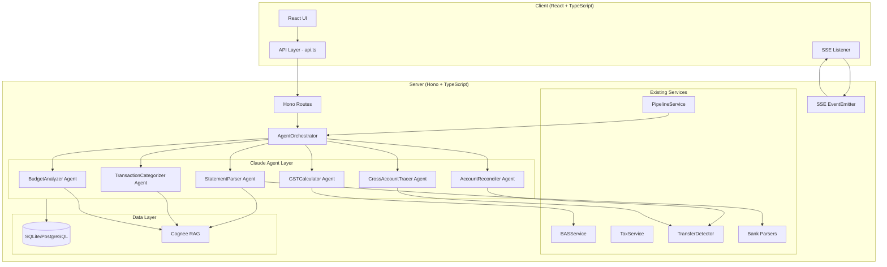
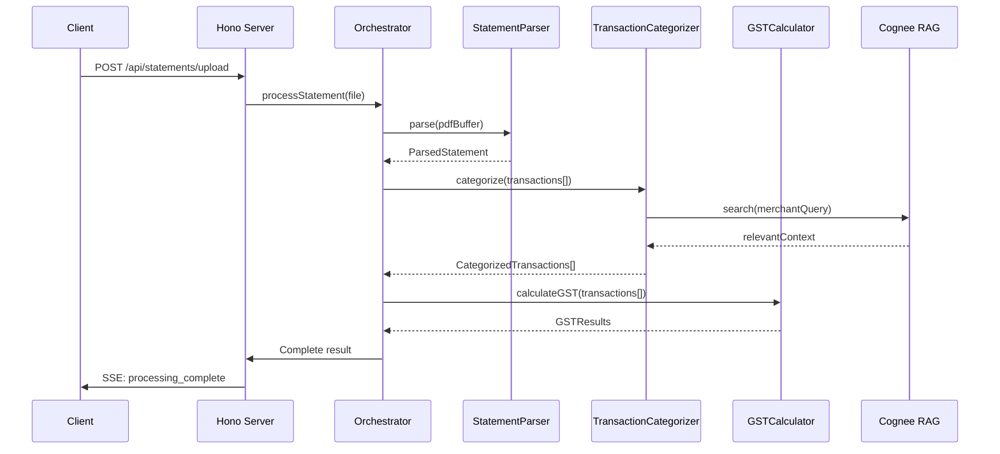
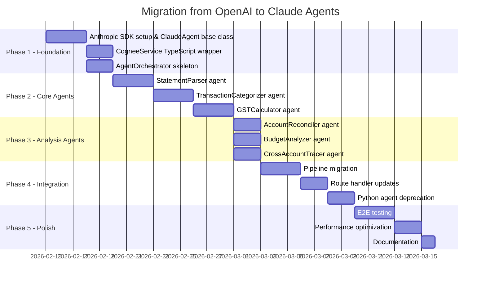

# Claude Agent Architecture

## CBA Statements Parse — AI Agent Upgrade

> Comprehensive architecture for migrating from OpenAI/OpenRouter to Claude-powered
> specialized agents with Cognee RAG integration.

---

## Table of Contents

1. [Current State Analysis](#1-current-state-analysis)
2. [Target Architecture](#2-target-architecture)
3. [Agent Specifications](#3-agent-specifications)
4. [Communication Patterns](#4-communication-patterns)
5. [Migration Plan](#5-migration-plan)
6. [Error Handling & Retry Strategies](#6-error-handling--retry-strategies)
7. [Hono Server Integration](#7-hono-server-integration)
8. [Cognee RAG Integration](#8-cognee-rag-integration)
9. [Configuration & Environment](#9-configuration--environment)

---

## 1. Current State Analysis

### 1.1 Architecture Overview

The application is a bank statement parsing and financial analysis platform:

| Layer | Stack | Key Files |
|-------|-------|-----------|
| **Client** | React 18 + TypeScript, TanStack Table, Tailwind CSS | `client/src/api.ts` (1024 lines — full API layer) |
| **Server** | Hono + Drizzle ORM, SQLite/PostgreSQL | `server/src/index.ts`, `server/src/db.ts` |
| **AI (TS)** | OpenAI SDK via OpenRouter | `server/src/services/ai.ts` (569 lines) |
| **AI (Python)** | Pydantic AI via OpenRouter | `server/src/services/agents/*.py` (14 files) |
| **RAG** | Cognee (Python subprocess) | `server/src/services/rag.ts` + `rag.py` |
| **Infra** | Docker Compose (server + nginx client) | `docker-compose.yml` |

### 1.2 Current AI Service (`ai.ts`)

The `AIService` class wraps OpenAI SDK routed through OpenRouter (`https://openrouter.ai/api/v1`).
Default model: `google/gemini-3-flash-preview`.

**Methods being replaced:**

| Method | Purpose | Structured Output |
|--------|---------|-------------------|
| `parseWithVision()` | PDF page → JSON transactions via vision model | `{ transactions: [...], accountInfo: {...} }` |
| `categorizeTransaction()` | Single transaction categorization | `{ category, confidence, gstCategory, ... }` |
| `categorizeTransactionsBatch()` | Batch categorization (up to 20) | `{ results: [...] }` |
| `generateInsight()` | Natural language financial insights | Free text |
| `parseStatementText()` | Extracted text → structured transactions | `{ transactions: [...] }` |
| `extractAccountInfo()` | Statement text → account metadata | `{ bankId, accountNumber, ... }` |
| `categorizeWithMemory()` | Category with merchant memory context | `{ category, confidence, ... }` |
| `detectTransfers()` | AI-enhanced transfer detection | `{ transfers: [...] }` |
| `analyzeDebtPayoff()` | Debt repayment strategy analysis | `{ strategies: [...] }` |

### 1.3 Current Python Agents

Four Pydantic AI agents called via `child_process.spawn` from Node.js:

| Agent | File | Tools |
|-------|------|-------|
| **FinancialAnalyst** | `financial_analyst.py` | `analyze_spending_patterns`, `calculate_monthly_averages`, `identify_recurring_transactions`, `project_future_balance` |
| **BASAgent** | `bas_agent.py` (555 lines) | `categorize_gst_transactions`, `calculate_gst_amounts`, `generate_bas_labels`, `identify_capital_purchases`, `calculate_payg_withholding`, `calculate_bas_summary`, etc. (10 tools) |
| **TaxAgent** | `tax_agent.py` (658 lines) | `calculate_tax_full`, `calculate_wfh_comparison`, `calculate_capital_gain`, `calculate_depreciation`, `identify_deductible_expenses`, `generate_tax_summary`, etc. (13 tools) |
| **ReconciliationAgent** | `reconciliation_agent.py` | `find_duplicate_transactions`, `verify_statement_balance`, `find_unmatched_transactions`, `check_statement_continuity` |

**Supporting modules:**
- `gst_rules.py` (484 lines) — regex-based GST categorization + `BASCalculator`
- `tax_config.py` (502 lines) — tax brackets, LITO/SAPTO, Medicare levy, deduction rates
- `cgt_calculator.py` (511 lines) — capital gains with 50% discount, FIFO/average cost
- `depreciation_calculator.py` (628 lines) — diminishing value, prime cost, instant write-off
- `code_interpreter.py` — sandboxed Python executor
- `observability.py` — Logfire tracing (optional)

### 1.4 Pipeline Flow (`pipeline.ts`)

```
PDF Upload → Statement Record Created
    ↓
processStatement(statementId, filePath)
    ↓
1. Extract text/images from PDF (pdf-parse / pdfjs-dist / sharp)
    ↓
2. Detect bank (BankParserRegistry.detect → confidence scoring)
    ↓
3. Parse transactions (bank-specific parser OR AI vision fallback)
    ↓
4. Categorize with memory (merchant memory → AI categorization)
    ↓
5. Insert to database (Drizzle ORM → SQLite/PostgreSQL)
    ↓
6. Update merchant memory
    ↓
7. Index in Cognee (RAG knowledge graph)
    ↓
8. Emit SSE events (real-time UI updates)
```

### 1.5 Bank Parsers

Eight bank-specific parsers inheriting from `BaseBankParser`:

| Bank | Parser | Detection Keywords |
|------|--------|--------------------|
| CBA | `cba.ts` (314 lines) | "Commonwealth Bank", "CommBank", "NetBank" |
| ANZ | `anz.ts` | "ANZ", "Australia and New Zealand" |
| Westpac | `westpac.ts` | "Westpac", "St.George" (shared) |
| NAB | `nab.ts` | "NAB", "National Australia Bank" |
| St George | `stgeorge.ts` | "St.George", "Bank of Melbourne" |
| Bendigo | `bendigo.ts` | "Bendigo Bank" |
| ING | `ing.ts` | "ING", "ING Direct" |
| Macquarie | `macquarie.ts` | "Macquarie Bank" |

Detection uses confidence thresholds: HIGH (0.7), MEDIUM (0.4), LOW (0.2).

### 1.6 RAG System

- **TypeScript wrapper** (`rag.ts`) spawns Python subprocess
- **Python backend** (`rag.py`) uses Cognee's `add()`, `search()`, `cognify()`, `prune()`
- Configured with OpenRouter LLM + local fastembed embeddings
- Indexes transactions as text: `"Date: ..., Description: ..., Amount: ..., Category: ..."`

---

## 2. Target Architecture

### 2.1 High-Level Architecture Diagram



### 2.2 Agent Communication Flow



### 2.3 Design Principles

1. **TypeScript-native agents** — All agents implemented in TypeScript using the Anthropic SDK (`@anthropic-ai/sdk`), eliminating the Python subprocess bridge
2. **Tool-use pattern** — Each agent exposes domain-specific tools to Claude, letting the model reason about which tools to call
3. **Structured output** — All agent responses use JSON schemas for type-safe I/O contracts
4. **Cognee-enriched context** — Agents query Cognee for merchant memory, historical patterns, and regulatory knowledge before making decisions
5. **Progressive migration** — Each agent can be deployed independently; the orchestrator falls back to existing services during transition
6. **Observability** — Structured logging, latency tracking, and token usage monitoring on every agent call

---

## 3. Agent Specifications

### 3.1 StatementParser Agent

**Role:** Extract structured transaction data from bank statement PDFs.

**When called:** On statement upload, after PDF text/image extraction.

**System prompt:**
```
You are a specialist in parsing Australian bank statements. Given extracted
text or images from a PDF bank statement, identify and extract all
transactions with their dates, descriptions, amounts, and running balances.
You understand the formats of all major Australian banks (CBA, ANZ, Westpac,
NAB, St George, Bendigo, ING, Macquarie). Return structured JSON.
```

**Tools:**

| Tool | Input | Output | Description |
|------|-------|--------|-------------|
| `detect_bank` | `{ text: string }` | `{ bankId: BankId, confidence: number }` | Identify which bank issued the statement |
| `parse_with_bank_parser` | `{ text: string, bankId: BankId }` | `ParsedTransaction[]` | Use the existing bank-specific parser |
| `extract_account_info` | `{ text: string }` | `AccountInfo` | Extract BSB, account number, name, type |
| `validate_transactions` | `{ transactions: ParsedTransaction[], text: string }` | `{ valid: boolean, issues: string[] }` | Cross-check extracted data against source |
| `search_cognee` | `{ query: string, datasetName: string }` | `string[]` | Search Cognee knowledge graph for context |

**I/O Contract:**

```typescript
// Input
interface StatementParserInput {
  statementId: number;
  extractedText: string;
  extractedImages?: string[];  // base64 for vision fallback
  fileName: string;
}

// Output
interface StatementParserOutput {
  bankId: BankId;
  bankConfidence: number;
  accountInfo: AccountInfo;
  transactions: ParsedTransaction[];
  parseMethod: 'bank_parser' | 'ai_vision' | 'ai_text';
  warnings: string[];
}
```

**Cognee integration:** Queries `bank_formats` dataset for historical parsing patterns when bank detection confidence is low. Indexes successful parse results for future reference.

---

### 3.2 TransactionCategorizer Agent

**Role:** Categorize transactions into the app's category taxonomy with confidence scores.

**When called:** After statement parsing, for each batch of uncategorized transactions.

**System prompt:**
```
You are an Australian financial transaction categorizer. Categorize bank
transactions into the correct category from the provided taxonomy. Consider
merchant memory (previous categorizations of the same merchant), transaction
description patterns, and amount ranges. Return a category, confidence score,
GST category, and reasoning notes for each transaction.
```

**Tools:**

| Tool | Input | Output | Description |
|------|-------|--------|-------------|
| `lookup_merchant_memory` | `{ description: string }` | `MerchantMemory \| null` | Check if this merchant was previously categorized |
| `search_similar_transactions` | `{ description: string, amount: number }` | `Transaction[]` | Find similar past transactions via Cognee |
| `get_category_taxonomy` | `{}` | `Category[]` | Get the full category list from constants |
| `batch_categorize` | `{ transactions: TransactionInput[] }` | `CategorizedResult[]` | Process up to 20 transactions at once |

**I/O Contract:**

```typescript
// Input
interface CategorizerInput {
  transactions: Array<{
    id: number;
    date: string;
    description: string;
    amount: number;        // cents
    accountId: number;
    bankId: BankId;
  }>;
  existingMerchantMemory: MerchantMemory[];
}

// Output
interface CategorizerOutput {
  results: Array<{
    transactionId: number;
    category: string;         // from categories.ts
    subCategory?: string;
    confidence: number;       // 0.0 - 1.0
    gstCategory: string;      // 'gst_free' | 'gst_applicable' | 'input_taxed' | 'capital'
    gstAmount?: number;       // cents
    aiReasoningNotes: string;
    merchantKey?: string;     // normalized merchant name for memory
    isRecurring?: boolean;
  }>;
  lowConfidenceIds: number[]; // transactions needing human review
}
```

**Cognee integration:** Queries `bank_transactions` dataset for similar historical transactions. Updates merchant memory after successful categorization. Indexes new categorization patterns.

---

### 3.3 GSTCalculator Agent

**Role:** Calculate GST obligations, generate BAS labels, and identify GST-relevant transaction categories.

**When called:** On BAS report generation, or when GST breakdown is requested.

**System prompt:**
```
You are an Australian GST and BAS specialist. Calculate GST amounts from
inclusive prices, categorize transactions by GST treatment (GST-free,
input-taxed, capital acquisitions, private/non-business), and populate BAS
labels (G1-G11, 1A, 1B, W1-W2, 5A, 7C-7D) according to ATO rules. You
understand the Australian financial year (July-June) and quarterly BAS periods.
```

**Tools:**

| Tool | Input | Output | Description |
|------|-------|--------|-------------|
| `categorize_gst` | `{ transactions: Transaction[] }` | `GSTCategorizedTransaction[]` | Apply GST rules from `gst_rules.py` logic |
| `calculate_gst_from_inclusive` | `{ amount: number, rate: number }` | `{ gst: number, exGst: number }` | GST = Amount * (Rate / (1 + Rate)) |
| `generate_bas_labels` | `{ transactions: GSTTransaction[], quarter: Quarter }` | `BASLabels` | Populate all BAS label amounts |
| `identify_capital_purchases` | `{ transactions: Transaction[] }` | `Transaction[]` | Find capital acquisitions (>$20k or asset-type) |
| `get_quarter_dates` | `{ year: number, quarter: 1\|2\|3\|4 }` | `{ start: string, end: string }` | Australian FY quarter boundaries |
| `calculate_payg_withholding` | `{ grossIncome: number, taxTable: string }` | `{ withholding: number }` | PAYG withholding calculation |
| `search_gst_rulings` | `{ query: string }` | `string[]` | Search Cognee for ATO GST rulings/guidance |

**I/O Contract:**

```typescript
// Input
interface GSTCalculatorInput {
  transactions: Transaction[];
  quarter: { year: number; quarter: 1 | 2 | 3 | 4 };
  accountId?: number;
  includePayg?: boolean;
}

// Output
interface GSTCalculatorOutput {
  basLabels: {
    G1: number;   // Total sales
    G2: number;   // Export sales
    G3: number;   // Other GST-free sales
    G10: number;  // Capital purchases
    G11: number;  // Non-capital purchases
    '1A': number; // GST on sales
    '1B': number; // GST on purchases
    W1: number;   // Total salary/wages
    W2: number;   // Withheld from wages
    '5A': number; // PAYG instalment
    '7C': number; // Fuel tax credits
    '7D': number; // Fuel tax credits overclaim
  };
  gstPayable: number;       // 1A - 1B (net GST)
  totalPayable: number;     // Net amount owing/refund
  transactionBreakdown: {
    gstApplicable: number;
    gstFree: number;
    inputTaxed: number;
    capitalAcquisitions: number;
    outOfScope: number;
  };
  warnings: string[];
}
```

**Cognee integration:** Queries `gst_rulings` dataset for edge-case GST treatment guidance. Queries `bank_transactions` for historical GST categorization of similar merchants.

---

### 3.4 AccountReconciler Agent

**Role:** Reconcile transactions across statements, detect duplicates, verify balances, and ensure statement continuity.

**When called:** After new statement processing, or on-demand reconciliation request.

**System prompt:**
```
You are a bank account reconciliation specialist. Verify that transactions
across statements are consistent, detect duplicates, check opening/closing
balance continuity, identify missing transactions, and flag discrepancies.
You understand that statements may overlap in date ranges and that transfers
between accounts should be matched.
```

**Tools:**

| Tool | Input | Output | Description |
|------|-------|--------|-------------|
| `find_duplicates` | `{ transactions: Transaction[], threshold: number }` | `DuplicatePair[]` | Find potential duplicate transactions by amount+date+description |
| `verify_balance_continuity` | `{ statements: Statement[] }` | `ContinuityResult` | Check opening balance = previous closing balance |
| `find_unmatched` | `{ transactions: Transaction[], bankStatement: Transaction[] }` | `Transaction[]` | Transactions in one source but not the other |
| `detect_transfers` | `{ transactions: Transaction[], accounts: Account[] }` | `TransferMatch[]` | Use TransferDetector for cross-account matching |
| `check_running_balance` | `{ transactions: Transaction[], openingBalance: number }` | `{ valid: boolean, discrepancies: Discrepancy[] }` | Verify running balance calculations |
| `search_historical_patterns` | `{ query: string }` | `string[]` | Search Cognee for known reconciliation patterns |

**I/O Contract:**

```typescript
// Input
interface ReconcilerInput {
  accountId: number;
  statementIds?: number[];     // specific statements, or all for account
  includeTransferDetection?: boolean;
  accounts?: Account[];        // for cross-account transfer matching
}

// Output
interface ReconcilerOutput {
  status: 'clean' | 'warnings' | 'errors';
  duplicates: Array<{
    transaction1Id: number;
    transaction2Id: number;
    confidence: number;
    reason: string;
  }>;
  balanceContinuity: {
    isContiguous: boolean;
    gaps: Array<{ afterStatement: number; expectedOpening: number; actualOpening: number }>;
  };
  transferMatches: TransferMatch[];
  unmatchedTransactions: Transaction[];
  runningBalanceErrors: Array<{
    transactionId: number;
    expected: number;
    actual: number;
  }>;
  summary: string;
}
```

**Cognee integration:** Queries historical reconciliation results to identify known patterns (e.g., recurring bank fees that commonly create small discrepancies).

---

### 3.5 BudgetAnalyzer Agent

**Role:** Analyze spending patterns, project future balances, identify savings opportunities, and generate financial insights.

**When called:** On dashboard load (summary insights), or on-demand analysis request.

**System prompt:**
```
You are a personal finance analyst specializing in Australian household and
small business budgeting. Analyze transaction history to identify spending
patterns, recurring expenses, unusual transactions, and savings opportunities.
Provide actionable insights with specific dollar amounts and timeframes.
Consider seasonal patterns, inflation, and the Australian cost of living.
```

**Tools:**

| Tool | Input | Output | Description |
|------|-------|--------|-------------|
| `analyze_spending_by_category` | `{ transactions: Transaction[], period: DateRange }` | `CategoryBreakdown[]` | Spending totals per category with trends |
| `identify_recurring` | `{ transactions: Transaction[] }` | `RecurringTransaction[]` | Detect subscriptions and regular payments |
| `calculate_monthly_averages` | `{ transactions: Transaction[], months: number }` | `MonthlyAverage[]` | Average income/expense per month |
| `project_balance` | `{ currentBalance: number, transactions: Transaction[], months: number }` | `Projection[]` | Future balance projection |
| `find_anomalies` | `{ transactions: Transaction[], stdDevThreshold: number }` | `Transaction[]` | Unusually large or unusual transactions |
| `search_financial_context` | `{ query: string }` | `string[]` | Search Cognee for historical financial context |
| `calculate_savings_rate` | `{ income: number, expenses: number }` | `{ rate: number, comparison: string }` | Savings rate vs Australian benchmarks |

**I/O Contract:**

```typescript
// Input
interface BudgetAnalyzerInput {
  accountIds: number[];
  dateRange?: { start: string; end: string };
  focusAreas?: ('spending' | 'income' | 'savings' | 'recurring' | 'anomalies')[];
  includeProjections?: boolean;
}

// Output
interface BudgetAnalyzerOutput {
  insights: Array<{
    type: 'spending' | 'income' | 'savings' | 'warning' | 'opportunity';
    title: string;
    description: string;
    amount?: number;
    trend?: 'up' | 'down' | 'stable';
    confidence: number;
  }>;
  categoryBreakdown: Array<{
    category: string;
    total: number;
    percentage: number;
    monthOverMonth: number;  // percentage change
  }>;
  recurringExpenses: Array<{
    description: string;
    amount: number;
    frequency: 'weekly' | 'fortnightly' | 'monthly' | 'quarterly' | 'annual';
    nextExpected: string;
  }>;
  projections?: Array<{
    month: string;
    projectedBalance: number;
    confidence: number;
  }>;
  savingsRate: number;
  summary: string;
}
```

**Cognee integration:** Queries `bank_transactions` for historical spending patterns. Indexes generated insights for longitudinal trend analysis.

---

### 3.6 CrossAccountTracer Agent

**Role:** Trace money flows across multiple accounts, detect inter-account transfers, and visualize fund movements.

**When called:** On cross-account report request, or when transfer detection runs.

**System prompt:**
```
You are a forensic accountant specializing in tracing fund movements across
multiple bank accounts. Detect inter-account transfers by matching
debits/credits across accounts using amount, date proximity, and description
analysis. Identify multi-hop transfer chains (A→B→C) and generate flow
reports. Distinguish genuine transfers from coincidental amount matches.
```

**Tools:**

| Tool | Input | Output | Description |
|------|-------|--------|-------------|
| `match_transfers` | `{ transactions: Transaction[], accounts: Account[], config?: TransferConfig }` | `TransferMatch[]` | Use TransferDetector with configurable thresholds |
| `detect_multi_hop` | `{ matches: TransferMatch[] }` | `TransferChain[]` | Find A→B→C chains |
| `calculate_net_flows` | `{ transactions: Transaction[], accounts: Account[] }` | `NetFlow[]` | Net money movement between account pairs |
| `generate_flow_diagram` | `{ flows: NetFlow[] }` | `{ mermaid: string }` | Mermaid diagram of money flows |
| `exclude_transfers` | `{ transactions: Transaction[], matches: TransferMatch[] }` | `Transaction[]` | Filter out transfer transactions |
| `search_transfer_patterns` | `{ query: string }` | `string[]` | Search Cognee for known transfer patterns |

**I/O Contract:**

```typescript
// Input
interface CrossAccountTracerInput {
  accountIds: number[];
  dateRange?: { start: string; end: string };
  config?: {
    matchWindowDays?: number;         // default: 3
    amountToleranceCents?: number;    // default: 500 ($5)
    minConfidence?: number;           // default: 0.6
  };
  includeFlowDiagram?: boolean;
}

// Output
interface CrossAccountTracerOutput {
  transfers: Array<{
    sourceAccountId: number;
    targetAccountId: number;
    sourceTransactionId: number;
    targetTransactionId: number;
    amount: number;
    date: string;
    confidence: number;
    matchReasons: string[];
  }>;
  multiHopChains: Array<{
    path: number[];     // account IDs in order
    totalAmount: number;
    transactionIds: number[];
  }>;
  netFlows: Array<{
    fromAccountId: number;
    toAccountId: number;
    netAmount: number;
    transactionCount: number;
  }>;
  flowDiagram?: string;  // Mermaid markup
  summary: string;
}
```

**Cognee integration:** Queries historical transfer patterns to improve confidence scoring. Indexes confirmed transfer links for future reference.

---

## 4. Communication Patterns

### 4.1 Orchestrator Pattern

All agents are invoked through a central `AgentOrchestrator` that manages:

1. **Agent selection** — Routes requests to the appropriate agent(s)
2. **Context assembly** — Gathers relevant data from DB + Cognee before agent invocation
3. **Result composition** — Merges multi-agent results into coherent responses
4. **Fallback handling** — Falls back to existing services if an agent fails

```typescript
class AgentOrchestrator {
  private agents: Map<AgentType, ClaudeAgent>;
  private cognee: CogneeService;

  async processStatement(statementId: number, filePath: string): Promise<ProcessResult> {
    // 1. StatementParser extracts transactions
    const parsed = await this.invoke('statement_parser', { statementId, filePath });

    // 2. TransactionCategorizer categorizes batch
    const categorized = await this.invoke('transaction_categorizer', {
      transactions: parsed.transactions,
      merchantMemory: await this.getMerchantMemory(parsed.transactions),
    });

    // 3. GSTCalculator adds GST treatment (async, non-blocking)
    const gstPromise = this.invoke('gst_calculator', {
      transactions: categorized.results,
      quarter: this.getCurrentQuarter(),
    });

    // 4. Persist results
    await this.saveTransactions(categorized.results);

    // 5. Index in Cognee (background)
    this.cognee.indexTransactions(categorized.results);

    return { parsed, categorized, gst: await gstPromise };
  }
}
```

### 4.2 Agent Invocation Pattern

Each agent is invoked via the Anthropic SDK using the **tool-use** pattern:

```typescript
import Anthropic from '@anthropic-ai/sdk';

class ClaudeAgent {
  private client: Anthropic;
  private model: string;
  private systemPrompt: string;
  private tools: Anthropic.Tool[];
  private toolHandlers: Map<string, (input: unknown) => Promise<unknown>>;

  async invoke(input: unknown): Promise<unknown> {
    const messages: Anthropic.MessageParam[] = [
      { role: 'user', content: JSON.stringify(input) },
    ];

    // Agentic loop: let Claude call tools until it produces a final answer
    while (true) {
      const response = await this.client.messages.create({
        model: this.model,
        max_tokens: 4096,
        system: this.systemPrompt,
        tools: this.tools,
        messages,
      });

      // Check if Claude wants to use tools
      const toolUseBlocks = response.content.filter(
        (block) => block.type === 'tool_use'
      );

      if (toolUseBlocks.length === 0) {
        // Final answer — extract text/JSON
        const textBlock = response.content.find((b) => b.type === 'text');
        return JSON.parse(textBlock?.text ?? '{}');
      }

      // Execute tool calls and feed results back
      const toolResults: Anthropic.ToolResultBlockParam[] = [];
      for (const toolUse of toolUseBlocks) {
        const handler = this.toolHandlers.get(toolUse.name);
        const result = await handler!(toolUse.input);
        toolResults.push({
          type: 'tool_result',
          tool_use_id: toolUse.id,
          content: JSON.stringify(result),
        });
      }

      // Continue conversation with tool results
      messages.push({ role: 'assistant', content: response.content });
      messages.push({ role: 'user', content: toolResults });
    }
  }
}
```

### 4.3 Inter-Agent Communication

Agents do **not** communicate directly. The orchestrator handles all data flow:

```
StatementParser ──→ Orchestrator ──→ TransactionCategorizer
                         │
                         ├──→ GSTCalculator
                         ├──→ AccountReconciler
                         ├──→ BudgetAnalyzer
                         └──→ CrossAccountTracer
```

**When agents need data from each other:**
1. Orchestrator invokes Agent A, receives result
2. Orchestrator transforms/filters result as needed
3. Orchestrator passes transformed data to Agent B as input

This keeps agents stateless and independently testable.

### 4.4 Parallel Execution

Independent agents can run concurrently:

```typescript
// After parsing and categorizing, these can run in parallel:
const [reconciliation, budget, transfers] = await Promise.all([
  this.invoke('account_reconciler', { accountId, statementIds }),
  this.invoke('budget_analyzer', { accountIds, dateRange }),
  this.invoke('cross_account_tracer', { accountIds }),
]);
```

---

## 5. Migration Plan

### 5.1 Phase Overview



### 5.2 Phase 1: Foundation (Days 1-5)

**Goal:** Set up Claude SDK infrastructure and base patterns.

1. **Install Anthropic SDK**
   ```bash
   cd server && npm install @anthropic-ai/sdk
   ```

2. **Create `server/src/services/claude/client.ts`**
   - Initialize Anthropic client with API key from env
   - Shared client singleton (like current `aiService`)

3. **Create `server/src/services/claude/base-agent.ts`**
   - `ClaudeAgent` base class with agentic tool-use loop
   - Structured JSON output parsing
   - Token usage tracking
   - Error handling with retries

4. **Create `server/src/services/claude/cognee-tools.ts`**
   - TypeScript-native Cognee integration tools
   - `searchCognee()`, `indexInCognee()` functions
   - Wraps existing `rag.ts` Python subprocess calls

5. **Create `server/src/services/claude/orchestrator.ts`**
   - `AgentOrchestrator` class skeleton
   - Agent registry and routing
   - Context assembly helpers

### 5.3 Phase 2: Core Agents (Days 6-14)

**Goal:** Implement the three agents critical to the statement processing pipeline.

1. **StatementParser** (`server/src/services/claude/agents/statement-parser.ts`)
   - Wraps existing bank parsers as tools
   - Vision fallback for unsupported formats
   - Replaces `aiService.parseWithVision()` and `aiService.parseStatementText()`

2. **TransactionCategorizer** (`server/src/services/claude/agents/transaction-categorizer.ts`)
   - Merchant memory lookup as a tool
   - Batch processing (up to 20 per invocation)
   - Replaces `aiService.categorizeTransaction()`, `categorizeTransactionsBatch()`, `categorizeWithMemory()`

3. **GSTCalculator** (`server/src/services/claude/agents/gst-calculator.ts`)
   - Ports `gst_rules.py` logic to TypeScript tools
   - BAS label generation
   - Replaces Python BASAgent subprocess calls

### 5.4 Phase 3: Analysis Agents (Days 15-20)

**Goal:** Implement secondary analysis agents.

These agents are less pipeline-critical and can be developed in parallel:

1. **AccountReconciler** — Wraps `TransferDetector` as a tool, adds AI-powered duplicate detection
2. **BudgetAnalyzer** — Replaces `aiService.generateInsight()` and Python FinancialAnalystAgent
3. **CrossAccountTracer** — Wraps `TransferDetector` with multi-hop and flow analysis

### 5.5 Phase 4: Integration (Days 21-27)

**Goal:** Wire agents into the existing server.

1. **Update `pipeline.ts`** — Replace `aiService` calls with `orchestrator` calls
2. **Update route handlers** — Replace direct `aiService` calls in Hono routes
3. **Deprecate Python agents** — Mark Python agent files as deprecated, remove subprocess calls
4. **Remove OpenAI dependency** — Remove `openai` from `package.json`

### 5.6 Phase 5: Polish (Days 28-33)

**Goal:** Ensure quality and performance.

1. **E2E testing** — Test full pipeline with real CBA/ANZ/Westpac statements
2. **Performance** — Optimize token usage, implement caching for repeated queries
3. **Documentation** — Update README, inline docs, API documentation

### 5.7 Rollback Strategy

During migration, the orchestrator supports dual-mode:

```typescript
class AgentOrchestrator {
  private useClaudeAgents: boolean;

  async categorize(transactions: Transaction[]): Promise<CategorizedResult[]> {
    if (this.useClaudeAgents) {
      try {
        return await this.invoke('transaction_categorizer', { transactions });
      } catch (error) {
        console.warn('Claude agent failed, falling back to OpenAI:', error);
        return await aiService.categorizeTransactionsBatch(transactions);
      }
    }
    return await aiService.categorizeTransactionsBatch(transactions);
  }
}
```

Toggle via environment variable: `USE_CLAUDE_AGENTS=true|false`

---

## 6. Error Handling & Retry Strategies

### 6.1 Retry Configuration

```typescript
interface RetryConfig {
  maxRetries: number;          // default: 3
  initialDelayMs: number;      // default: 1000
  maxDelayMs: number;          // default: 30000
  backoffMultiplier: number;   // default: 2
  retryableErrors: string[];   // HTTP status codes / error types
}

const DEFAULT_RETRY_CONFIG: RetryConfig = {
  maxRetries: 3,
  initialDelayMs: 1000,
  maxDelayMs: 30000,
  backoffMultiplier: 2,
  retryableErrors: ['rate_limit_error', 'overloaded_error', 'api_error'],
};
```

### 6.2 Error Categories

| Error Type | Retry? | Action |
|-----------|--------|--------|
| `rate_limit_error` (429) | Yes | Exponential backoff, respect `retry-after` header |
| `overloaded_error` (529) | Yes | Exponential backoff with jitter |
| `api_error` (500) | Yes, up to 2 | Retry then fall back to existing service |
| `authentication_error` (401) | No | Log error, alert, fail immediately |
| `invalid_request_error` (400) | No | Log input, fail with descriptive error |
| Tool execution error | Depends | Retry tool call; if persistent, skip tool and let Claude reason without it |
| JSON parse error | Yes, once | Re-invoke with explicit "return valid JSON" instruction |
| Timeout (>60s) | Yes, once | Retry with reduced input size |

### 6.3 Circuit Breaker

```typescript
class AgentCircuitBreaker {
  private failures: number = 0;
  private lastFailure: Date | null = null;
  private state: 'closed' | 'open' | 'half-open' = 'closed';

  readonly failureThreshold = 5;       // Open after 5 consecutive failures
  readonly recoveryTimeMs = 60_000;    // Try again after 1 minute

  async execute<T>(fn: () => Promise<T>, fallback: () => Promise<T>): Promise<T> {
    if (this.state === 'open') {
      if (Date.now() - this.lastFailure!.getTime() > this.recoveryTimeMs) {
        this.state = 'half-open';
      } else {
        return fallback();
      }
    }

    try {
      const result = await fn();
      this.failures = 0;
      this.state = 'closed';
      return result;
    } catch (error) {
      this.failures++;
      this.lastFailure = new Date();
      if (this.failures >= this.failureThreshold) {
        this.state = 'open';
      }
      return fallback();
    }
  }
}
```

### 6.4 Token Budget Management

Each agent has a token budget to prevent runaway costs:

```typescript
interface TokenBudget {
  maxInputTokens: number;
  maxOutputTokens: number;
  maxToolCalls: number;      // prevent infinite tool loops
  warningThresholdPercent: number;
}

const AGENT_TOKEN_BUDGETS: Record<AgentType, TokenBudget> = {
  statement_parser:         { maxInputTokens: 100_000, maxOutputTokens: 8_000,  maxToolCalls: 10, warningThresholdPercent: 80 },
  transaction_categorizer:  { maxInputTokens: 50_000,  maxOutputTokens: 8_000,  maxToolCalls: 5,  warningThresholdPercent: 80 },
  gst_calculator:           { maxInputTokens: 30_000,  maxOutputTokens: 4_000,  maxToolCalls: 8,  warningThresholdPercent: 80 },
  account_reconciler:       { maxInputTokens: 50_000,  maxOutputTokens: 4_000,  maxToolCalls: 8,  warningThresholdPercent: 80 },
  budget_analyzer:          { maxInputTokens: 50_000,  maxOutputTokens: 8_000,  maxToolCalls: 8,  warningThresholdPercent: 80 },
  cross_account_tracer:     { maxInputTokens: 30_000,  maxOutputTokens: 4_000,  maxToolCalls: 6,  warningThresholdPercent: 80 },
};
```

---

## 7. Hono Server Integration

### 7.1 New Route Structure

The agents integrate into existing Hono routes — no new routes needed for the core pipeline. New routes only for explicit agent interactions:

```typescript
// server/src/routes/agents.ts
import { Hono } from 'hono';
import { orchestrator } from '../services/claude/orchestrator';

const agents = new Hono();

// Explicit agent invocation (for chat/analysis features)
agents.post('/analyze', async (c) => {
  const { query, accountIds, dateRange } = await c.req.json();
  const result = await orchestrator.analyze(query, { accountIds, dateRange });
  return c.json(result);
});

// BAS report generation
agents.post('/bas/calculate', async (c) => {
  const { quarter, accountId } = await c.req.json();
  const result = await orchestrator.invoke('gst_calculator', {
    transactions: await getQuarterTransactions(quarter, accountId),
    quarter,
  });
  return c.json(result);
});

// Reconciliation
agents.post('/reconcile', async (c) => {
  const { accountId, statementIds } = await c.req.json();
  const result = await orchestrator.invoke('account_reconciler', {
    accountId,
    statementIds,
  });
  return c.json(result);
});

// Cross-account transfer analysis
agents.post('/transfers/analyze', async (c) => {
  const { accountIds, dateRange } = await c.req.json();
  const result = await orchestrator.invoke('cross_account_tracer', {
    accountIds,
    dateRange,
    includeFlowDiagram: true,
  });
  return c.json(result);
});

export default agents;
```

### 7.2 Pipeline Integration Points

The `PipelineService` changes are minimal — replace method calls:

```typescript
// BEFORE (pipeline.ts)
const parsed = await aiService.parseWithVision(images, model);
const categorized = await aiService.categorizeWithMemory(tx, memory);

// AFTER
const parsed = await orchestrator.invoke('statement_parser', {
  statementId, extractedText, extractedImages
});
const categorized = await orchestrator.invoke('transaction_categorizer', {
  transactions, existingMerchantMemory,
});
```

### 7.3 SSE Event Integration

Agents emit progress events through the existing SSE system:

```typescript
class AgentOrchestrator {
  private emitProgress(agentType: AgentType, status: string, data?: unknown) {
    events.emit('update', {
      type: 'agent_progress',
      agent: agentType,
      status,
      data,
      timestamp: new Date().toISOString(),
    });
  }

  async invoke(agentType: AgentType, input: unknown): Promise<unknown> {
    this.emitProgress(agentType, 'started');
    try {
      const result = await this.agents.get(agentType)!.invoke(input);
      this.emitProgress(agentType, 'completed', { tokenUsage: result.usage });
      return result;
    } catch (error) {
      this.emitProgress(agentType, 'error', { error: error.message });
      throw error;
    }
  }
}
```

---

## 8. Cognee RAG Integration

### 8.1 Dataset Strategy

Each agent uses specific Cognee datasets:

| Dataset | Indexed By | Queried By | Content |
|---------|-----------|------------|---------|
| `bank_transactions` | TransactionCategorizer | All agents | Transaction descriptions, categories, amounts |
| `bank_formats` | StatementParser | StatementParser | Bank statement layout patterns |
| `gst_rulings` | GSTCalculator | GSTCalculator | GST treatment decisions and edge cases |
| `reconciliation_patterns` | AccountReconciler | AccountReconciler | Known discrepancy patterns |
| `financial_insights` | BudgetAnalyzer | BudgetAnalyzer | Generated insights and trend data |
| `transfer_patterns` | CrossAccountTracer | CrossAccountTracer | Confirmed transfer links |

### 8.2 Cognee Tool Interface

```typescript
// server/src/services/claude/cognee-tools.ts

interface CogneeToolConfig {
  searchTopK: number;        // default: 5
  indexBatchSize: number;    // default: 50
  datasetPrefix: string;     // namespace per user
}

class CogneeTools {
  async search(query: string, dataset: string): Promise<string[]> {
    // Calls rag.py search command via subprocess
    return this.runPython(['search', query, dataset]);
  }

  async index(data: string[], dataset: string): Promise<void> {
    // Calls rag.py add command via subprocess
    await this.runPython(['add', JSON.stringify(data), dataset]);
  }

  async cognify(dataset: string): Promise<void> {
    // Build knowledge graph from indexed data
    await this.runPython(['cognify', dataset]);
  }
}
```

### 8.3 Future: TypeScript-Native Cognee

Once Cognee provides a TypeScript SDK or REST API, the Python subprocess bridge can be replaced:

```typescript
// Future migration target
import { CogneeClient } from '@cognee/sdk';

const cognee = new CogneeClient({ apiKey: process.env.COGNEE_API_KEY });
await cognee.add(data, { dataset: 'bank_transactions' });
const results = await cognee.search(query, { dataset: 'bank_transactions', topK: 5 });
```

---

## 9. Configuration & Environment

### 9.1 Environment Variables

```bash
# Claude API
ANTHROPIC_API_KEY=sk-ant-...
CLAUDE_MODEL=claude-sonnet-4-5-20250929    # Default model for agents
CLAUDE_VISION_MODEL=claude-sonnet-4-5-20250929  # Model with vision for PDF parsing

# Agent Feature Flags
USE_CLAUDE_AGENTS=true              # Master switch
AGENT_STATEMENT_PARSER=true         # Per-agent toggles
AGENT_TRANSACTION_CATEGORIZER=true
AGENT_GST_CALCULATOR=true
AGENT_ACCOUNT_RECONCILER=true
AGENT_BUDGET_ANALYZER=true
AGENT_CROSS_ACCOUNT_TRACER=true

# Agent Tuning
AGENT_MAX_RETRIES=3
AGENT_TIMEOUT_MS=60000
AGENT_MAX_TOOL_CALLS=10

# Cognee RAG (existing)
OPENROUTER_API_KEY=sk-or-...
COGNEE_LLM_MODEL=google/gemini-3-flash-preview

# Existing (unchanged)
DATABASE_URL=file:./sqlite.db
VITE_API_URL=http://localhost:3501
```

### 9.2 Docker Compose Update

```yaml
services:
  cba-server:
    environment:
      - ANTHROPIC_API_KEY=${ANTHROPIC_API_KEY}
      - USE_CLAUDE_AGENTS=true
      - CLAUDE_MODEL=claude-sonnet-4-5-20250929
    # ... existing config
```

### 9.3 File Structure

```
server/src/services/claude/
├── client.ts              # Anthropic SDK client singleton
├── base-agent.ts          # ClaudeAgent base class with tool-use loop
├── orchestrator.ts        # AgentOrchestrator (routing, context, fallback)
├── cognee-tools.ts        # Cognee RAG tool implementations
├── types.ts               # Shared agent types and interfaces
├── config.ts              # Agent configuration and token budgets
├── retry.ts               # Retry logic and circuit breaker
└── agents/
    ├── statement-parser.ts
    ├── transaction-categorizer.ts
    ├── gst-calculator.ts
    ├── account-reconciler.ts
    ├── budget-analyzer.ts
    └── cross-account-tracer.ts
```

---

## Appendix A: Model Selection Guide

| Use Case | Recommended Model | Reasoning |
|----------|-------------------|-----------|
| Statement parsing (text) | `claude-sonnet-4-5-20250929` | Good balance of speed and accuracy |
| Statement parsing (vision) | `claude-sonnet-4-5-20250929` | Vision capable, fast enough for pipeline |
| Transaction categorization | `claude-haiku-4-5-20251001` | High throughput needed, simpler task |
| GST calculation | `claude-sonnet-4-5-20250929` | Regulatory accuracy important |
| Budget analysis | `claude-sonnet-4-5-20250929` | Nuanced financial reasoning |
| Reconciliation | `claude-haiku-4-5-20251001` | Mostly pattern matching, speed matters |
| Cross-account tracing | `claude-haiku-4-5-20251001` | Algorithmic with AI verification |

## Appendix B: Cost Estimation

Based on Anthropic API pricing (as of Feb 2026):

| Agent | Avg Input Tokens | Avg Output Tokens | Calls/Statement | Est. Cost/Statement |
|-------|-----------------|-------------------|-----------------|---------------------|
| StatementParser | 10,000 | 2,000 | 1 | ~$0.04 |
| TransactionCategorizer | 5,000 | 1,500 | 1-3 (batched) | ~$0.03 |
| GSTCalculator | 3,000 | 1,000 | 1 | ~$0.01 |
| **Total per statement** | | | | **~$0.08** |

Analysis agents (on-demand, not per-statement):

| Agent | Est. Cost/Invocation |
|-------|---------------------|
| AccountReconciler | ~$0.03 |
| BudgetAnalyzer | ~$0.05 |
| CrossAccountTracer | ~$0.02 |
