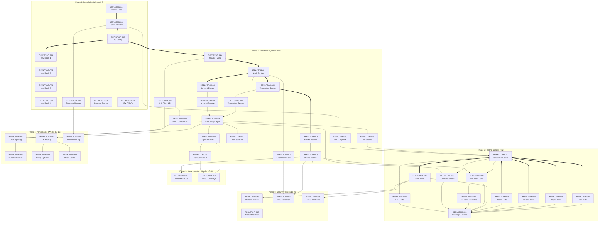

# GoldLedger Enterprise-Grade Refactoring Plan

**Version**: 1.0
**Date**: 2026-02-13
**Status**: Draft
**Author**: Augment Agent (Automated Audit)

---

## 1. Executive Summary

### Overview

GoldLedger is a full-stack accounting platform (React + Hono/Drizzle) built across 24 development waves. While feature-complete, the codebase has accumulated significant technical debt that must be resolved before it can meet enterprise standards comparable to Xero and MYOB. This plan defines a 20-week phased refactoring initiative to transform ~170K lines of source code into a production-grade, maintainable, and secure system.

### Current State Snapshot

| Metric | Current Value | Target |
|--------|--------------|--------|
| Total files (excl. deps/external) | 2,553 | <800 |
| Source files (server/src + client/src) | 622 | ~650 (after split) |
| Source lines (TS/TSX) | 170,397 | ~180K (with tests) |
| `any` type usages | 1,134 | 0 |
| `@ts-ignore` / `@ts-expect-error` | 3 | 0 |
| TODO/FIXME comments | 34 | 0 (all ticketed) |
| `console.log/warn/error` calls | 894 | 0 (use structured logger) |
| Files >300 lines | 178 | 0 |
| `server/src/index.ts` lines | 5,987 | <300 (route mounting only) |
| `client/src/api.ts` lines | 2,546 | <300 (split per feature) |
| Test files | 12 | >200 |
| Test coverage (estimated) | <5% | >80% |
| Agent-done marker files | 248 | 0 (removed) |
| Wave scaffolding files | 370+ | 0 (archived) |
| Hardcoded secrets (approx) | 2 | 0 |
| Zod validation schemas | ~590 defs | Comprehensive |
| Exported classes | 177 | Maintained |
| Exported functions | 489 | Maintained |

### Timeline

**20 weeks** across 6 phases:

- Phase 1 (Weeks 1–3): Foundation — Cleanup, linting, type safety
- Phase 2 (Weeks 4–8): Architecture — Layered feature-based restructure
- Phase 3 (Weeks 9–12): Testing — Achieve >80% coverage
- Phase 4 (Weeks 13–16): Performance — Bundle, DB, caching optimization
- Phase 5 (Weeks 17–18): Documentation — API docs, Storybook, ADRs
- Phase 6 (Weeks 19–20): Security Hardening — Auth, validation, pen testing

### Resource Requirements

| Resource | Estimate |
|----------|----------|
| Senior Full-Stack Developer | 1 FTE, 20 weeks |
| DevOps / CI-CD setup | 0.25 FTE, 4 weeks |
| QA / Test Engineer | 0.5 FTE, 12 weeks |
| Security Consultant | 1 week (pen test) |
| Tools | ESLint, Prettier, Vitest, Playwright, Turborepo, Storybook, Sentry |

### Business Impact

- **Maintainability**: New developer onboarding from ~4 weeks → <1 week
- **Velocity**: Feature development 2–3× faster with proper architecture
- **Reliability**: >80% test coverage catches regressions before production
- **Security**: Enterprise-grade auth, validation, and encryption
- **Scalability**: Proper caching and DB optimization for 1000+ concurrent users

### Risk Assessment (Summary)

| Risk | Likelihood | Impact | Mitigation |
|------|-----------|--------|------------|
| Breaking existing features | Medium | High | Incremental approach, comprehensive tests before refactoring |
| Timeline overrun | Medium | Medium | Prioritize P0/P1 tasks, defer P3 |
| Scope creep | High | Medium | Strict task boundaries (max 500 lines/PR) |
| Developer burnout | Low | High | Phased approach with clear milestones |

### ROI

- **Reduced maintenance cost**: ~40% less time debugging/fixing issues
- **Faster onboarding**: 75% reduction in ramp-up time
- **Fewer production incidents**: >80% test coverage prevents regressions
- **Security compliance**: Meets enterprise audit requirements

---

## 2. Analysis Phase — Pre-Refactoring Audit Results

### A. Code Quality Audit

#### Technical Debt Inventory

| Category | Count | Severity |
|----------|-------|----------|
| `any` type usages | 1,134 | High |
| `@ts-ignore` comments | 2 | Medium |
| `@ts-expect-error` comments | 1 | Low |
| TODO/FIXME comments | 34 | Medium |
| `console.log/warn/error` | 894 | Medium |
| Non-null assertions (`!`) | ~137 | Medium |
| Hardcoded secrets (approx) | 2 | Critical |
| `try-catch` blocks | 1,187 | Info (audit for proper handling) |
| `dangerouslySetInnerHTML` | 0 | ✅ Clean |

#### File Size Analysis — Files >300 Lines (Top 20 Worst Offenders)

| File | Lines | Recommended Action |
|------|-------|--------------------|
| `server/src/index.ts` | 5,987 | **CRITICAL**: Split into route modules |
| `client/src/api.ts` | 2,546 | Split into per-feature API modules |
| `server/src/schema.ts` | 1,906 | Split into per-domain schema files |
| `server/src/services/cross-module-intelligence.ts` | 1,279 | Extract sub-services |
| `server/src/services/teams.ts` | 1,262 | Extract into team sub-modules |
| `server/src/services/cognee_client.ts` | 1,254 | Extract into cognee sub-modules |
| `server/src/services/sbr-export.ts` | 1,190 | Extract report generators |
| `server/src/services/purchase-orders.ts` | 1,141 | Extract into PO sub-services |
| `server/src/db/postgres-schema.ts` | 1,133 | Split into per-domain schemas |
| `client/src/features/transactions/TransactionTable.tsx` | 1,024 | Extract columns, filters, hooks |
| `server/src/services/loan-calculator.ts` | 1,004 | Extract calculation modules |
| `client/src/features/bas/BASDashboard.tsx` | 993 | Extract sub-components |
| `server/src/services/payment-matching.ts` | 984 | Extract matching strategies |
| `server/src/services/pipeline.ts` | 977 | Extract pipeline stages |
| `server/src/services/bank-reconciliation.ts` | 969 | Extract recon sub-services |
| `server/src/services/consolidation.ts` | 967 | Extract consolidation steps |
| `server/src/services/tax.ts` | 956 | Extract tax calculators |
| `server/src/services/cdr-crawler.ts` | 917 | Extract crawler strategies |
| `server/src/services/bills.ts` | 913 | Extract bill sub-services |
| `server/src/services/financial-reports.ts` | 897 | Extract report generators |

**Total files >300 lines**: 178 (30.5% of source files)

#### TypeScript Configuration Assessment

| Setting | Server | Client | Target |
|---------|--------|--------|--------|
| `strict` | ✅ true | ✅ true | ✅ |
| `noUnusedLocals` | ❌ missing | ❌ false | true |
| `noUnusedParameters` | ❌ missing | ❌ false | true |
| `noImplicitReturns` | ❌ missing | ❌ false | true |
| `noFallthroughCasesInSwitch` | ❌ missing | ✅ true | true |
| `noUncheckedIndexedAccess` | ❌ missing | ❌ false | true |

### B. Architecture Assessment

#### Current Architecture

The application follows a **monolith-in-monorepo** pattern:

- **Client**: React 19 + Vite + Tailwind CSS v4 + React Router v7
  - Feature-based directory structure under `client/src/features/` (35 feature dirs)
  - Shared components under `client/src/components/` (charts, common, layout, pwa, ui)
  - Centralized API layer in single `api.ts` (2,546 lines — anti-pattern)
  - State management: Local state + React Router (no global state manager)

- **Server**: Hono v4 + Drizzle ORM + TypeScript
  - **Monolithic entry point**: `server/src/index.ts` (5,987 lines) contains ALL route definitions inline
  - Services directory with 100+ service files (flat structure, no feature grouping)
  - Claude AI agents under `server/src/services/claude/agents/`
  - RAG pipeline under `server/src/services/rag/`
  - Parsers under `server/src/services/parsers/`

- **Database**: Dual-schema (SQLite dev + PostgreSQL prod) via Drizzle ORM
  - Schema in `server/src/schema.ts` (1,906 lines) + `server/src/db/postgres-schema.ts` (1,133 lines)
  - Migrations in `docker/migrations/`

#### Critical Layering Violations

1. **Route handlers contain business logic**: `server/src/index.ts` has ~5,700 lines of inline route handlers with business logic, DB queries, and response formatting all mixed together
2. **No repository pattern**: Database queries are scattered across services and route handlers
3. **No dependency injection**: Services instantiate their own dependencies, making testing difficult
4. **Client API monolith**: All 200+ API calls in a single `api.ts` file
5. **Schema monolith**: All DB tables defined in single files instead of per-domain

#### Feature Coupling Analysis

- Client features are reasonably well-isolated in `client/src/features/`
- Server services are flat (no feature grouping) — `server/src/services/` has 100+ files at one level
- Cross-module intelligence service (1,279 lines) couples multiple domains
- No clear public API boundaries between features

#### Database Access Patterns

- **Direct queries in routes**: The 5,987-line `index.ts` contains direct Drizzle queries
- **Services with mixed concerns**: Services both contain business logic AND database access
- **No repository abstraction**: No consistent data access layer

### C. Dependency Analysis

#### Package Dependencies

**Server** (29 dependencies, 12 devDependencies):

- Core: `hono`, `drizzle-orm`, `@hono/node-server`
- AI: `@anthropic-ai/sdk`, `@ai-sdk/anthropic`, `@ai-sdk/openai`, `openai`, `ai` (Vercel AI SDK)
- Auth: `bcryptjs`, `hono/jwt` (built-in)
- DB: `pg`, `@libsql/client`, `better-sqlite3` (root)
- PDF: `pdf-parse`, `pdf-lib`, `pdf-to-img`, `pdfjs-dist`, `sharp`
- Payments: `stripe`
- Email: `resend`
- Notifications: `web-push`
- Rate limiting: `hono-rate-limiter`
- Cache: `ioredis`

**Client** (14 dependencies, 12 devDependencies):

- Core: `react` v19, `react-dom` v19, `react-router-dom` v7
- UI: `@radix-ui/*` (label, progress, select, slot, switch, tabs), `lucide-react`, `recharts`, `sonner`
- Table: `@tanstack/react-table`, `@tanstack/react-virtual`
- Styling: `tailwindcss` v4, `class-variance-authority`, `clsx`, `tailwind-merge`
- Offline: `idb`

#### Dependency Issues

| Issue | Severity | Recommendation |
| ----- | -------- | -------------- |
| Duplicate AI SDKs: `@anthropic-ai/sdk` + `@ai-sdk/anthropic`, `openai` + `@ai-sdk/openai` | Medium | Consolidate to Vercel AI SDK (`ai` + `@ai-sdk/*`) |
| 4 PDF libraries: `pdf-parse`, `pdf-lib`, `pdf-to-img`, `pdfjs-dist` | Medium | Audit usage, consolidate to 1-2 |
| `@types/bcryptjs` in `dependencies` (should be `devDependencies`) | Low | Move to devDependencies |
| `@types/ioredis` in `dependencies` (should be `devDependencies`) | Low | Move to devDependencies |
| No shared types package between client/server | High | Create `packages/shared/` |
| `chokidar` in server deps (file watcher — dev only?) | Low | Verify if needed in production |
| `google-auth-library` — unclear usage | Low | Audit if still needed |

### D. Security Audit

#### Authentication

| Check | Status | Notes |
| ----- | ------ | ----- |
| JWT-based auth | ✅ | Via `hono/jwt` |
| JWT_SECRET from env | ✅ | Required at startup |
| Password hashing | ✅ | bcryptjs |
| Refresh token mechanism | ⚠️ Missing | No token refresh — sessions expire silently |
| MFA / 2FA | ⚠️ Missing | No multi-factor authentication |
| JWT expiry configuration | ⚠️ Unclear | Not visible in config |
| Account lockout | ⚠️ Missing | No brute-force protection beyond rate limiting |

#### Authorization

| Check | Status | Notes |
| ----- | ------ | ----- |
| RBAC implementation | ✅ | `RBACService` with permission/role middleware |
| Role hierarchy | ✅ | owner > admin > accountant > bookkeeper > viewer |
| Permission middleware | ✅ | `createPermissionMiddleware()` available |
| Role middleware | ✅ | `createRoleMiddleware()` available |
| Consistent RBAC on all routes | ⚠️ Partial | Many routes in `index.ts` lack RBAC checks |

#### Input Validation

| Check | Status | Notes |
| ----- | ------ | ----- |
| Zod schemas defined | ✅ | ~590 schema definitions |
| Validation middleware | ✅ | `validateBody()` pattern exists |
| All inputs validated | ⚠️ Partial | Only 15 Zod imports — many routes unvalidated |
| File upload validation | ⚠️ Unclear | Body limit exists but file type validation unclear |

#### Infrastructure Security

| Check | Status | Notes |
| ----- | ------ | ----- |
| Security headers (OWASP) | ✅ | `securityHeaders()` middleware |
| CORS | ✅ | Configured (localhost only) |
| Rate limiting | ✅ | General + chat-specific limiters |
| Rate limits production-ready | ⚠️ No | 1000 req/min general, 100 req/min chat (dev values) |
| CORS production-ready | ⚠️ No | Hardcoded localhost origins |
| TFN encryption | ✅ | Wave 4 implementation |
| `dangerouslySetInnerHTML` | ✅ | 0 usages |
| Hardcoded secrets | ⚠️ ~2 found | Need to move to env vars |

### E. Test Coverage Analysis

#### Current State

| Metric | Value |
| ------ | ----- |
| Total test files | 12 |
| Unit tests | 3 (`accounts.test.ts`, `ai.test.ts`, `abn.test.ts`) |
| Integration tests | 8 (wave18/19 validation tests) |
| Pipeline test | 1 (`pipeline.test.ts`) |
| E2E tests | 0 |
| Client-side tests | 0 |
| Estimated line coverage | <5% |
| Test framework | Vitest (server + client configured) |

#### Critical Gaps

| Area | Test Count | Risk |
| ---- | ---------- | ---- |
| Tax calculations (GST, BAS, STP) | 0 | **Critical** — financial accuracy |
| Payroll processing | 0 | **Critical** — compliance |
| Invoicing & billing | 0 | **Critical** — revenue |
| Bank reconciliation | 0 | **High** — data integrity |
| Auth flow (login/register/JWT) | 0 | **High** — security |
| Claude agent framework | 0 | **High** — AI reliability |
| Client components | 0 | **Medium** — UI regressions |
| API client (`api.ts`) | 0 | **Medium** — integration |
| E2E user flows | 0 | **High** — end-to-end confidence |

### F. Performance Assessment (Static Analysis)

#### Client Bundle Concerns

- No code splitting — single `routes.tsx` with all routes loaded eagerly
- No `React.lazy()` usage detected
- `recharts` (~500KB) loaded for all users regardless of feature usage
- All 35 feature modules loaded at startup
- No service worker caching strategy for API responses

#### Server Concerns

- Monolithic `index.ts` loads ALL services at startup (slow cold start)
- 894 `console.log` calls impact I/O performance in production
- No connection pooling configuration visible for PostgreSQL
- Redis caching infrastructure exists but utilization unclear
- No query optimization or indexing strategy documented
- No request/response compression middleware

---

## 3. Deprecation Manifest

### Summary Statistics

| Category | File Count | Action |
| -------- | ---------- | ------ |
| Wave orchestration prompts | 28 | Archive |
| Wave agent task directories | 278 | Archive |
| Wave launch scripts | 32 | Archive |
| Agent-done markers | 248 | Archive |
| Research/review files | 32 | Archive |
| Wave validation files | ~10 | Archive |
| Server audit scripts/output | ~5 | Archive |
| Bulk processing scripts | 5 | Archive |
| Backup files | 1 | Archive |
| Root screenshots (PNG) | 4 | Archive |
| Statement PDFs | 36 | Archive (test data) |
| `cognee-repo/` (external ref) | ~thousands | Archive |
| `neon-repo/` (external ref) | ~thousands | Archive |
| Misc root files (`nul`, `gen.cjs`, etc.) | ~5 | Archive |
| **Total files to remove/archive** | **~700+** | — |
| **Estimated post-cleanup file count** | **<800** | — |

### Detailed Deprecation Table

| File/Pattern | Category | Reason | Safe to Delete | Destination |
| ------------ | -------- | ------ | -------------- | ----------- |
| `wave*-orchestration-prompt.md` (×28) | Scaffolding | Wave build artifacts | Yes | `deprecated/wave-scaffolding/` |
| `wave*-agent-tasks/` (×278 files) | Scaffolding | Wave task definitions | Yes | `deprecated/wave-scaffolding/` |
| `launch-wave*.sh` (×32) | Scaffolding | Wave launch scripts | Yes | `deprecated/wave-scaffolding/` |
| `.agent-done-*` (×248) | Markers | Agent coordination markers | Yes | `deprecated/agent-markers/` |
| `wave0-research/`, `wave0-reviews/` | Planning | Research artifacts | Yes | `deprecated/planning-artifacts/` |
| `wave0b-research/`, `wave0b-reviews/` | Planning | Research artifacts | Yes | `deprecated/planning-artifacts/` |
| `wave0c-research/`, `wave0c-reviews/` | Planning | Research artifacts | Yes | `deprecated/planning-artifacts/` |
| `wave-validation-agent-tasks/` | Validation | One-time validation | Yes | `deprecated/wave-scaffolding/` |
| `wave-validation-orchestration-prompt.md` | Validation | One-time validation | Yes | `deprecated/wave-scaffolding/` |
| `wave-validation-reports/` | Validation | One-time reports | Yes | `deprecated/wave-scaffolding/` |
| `server/audit-details.cjs` | Audit | One-time audit script | Yes | `deprecated/audit-artifacts/` |
| `server/audit-output.txt` | Audit | One-time audit output | Yes | `deprecated/audit-artifacts/` |
| `server/audit-output2.txt` | Audit | One-time audit output | Yes | `deprecated/audit-artifacts/` |
| `server/audit-transactions.cjs` | Audit | One-time audit script | Yes | `deprecated/audit-artifacts/` |
| `server/bulk-categorize.ts` | Migration | One-time bulk script | Yes | `deprecated/migration-scripts/` |
| `server/bulk-import.ts` | Migration | One-time bulk script | Yes | `deprecated/migration-scripts/` |
| `server/batch-process.mjs` | Migration | One-time batch script | Yes | `deprecated/migration-scripts/` |
| `server/batch-process.ts` | Migration | One-time batch script | Yes | `deprecated/migration-scripts/` |
| `server/categorize-all.cjs` | Migration | One-time categorization | Yes | `deprecated/migration-scripts/` |
| `server/categorize-transactions.sql` | Migration | One-time SQL script | Yes | `deprecated/migration-scripts/` |
| `server/reprocess-failed.ts` | Migration | One-time reprocessing | Yes | `deprecated/migration-scripts/` |
| `server/check-db.cjs` | Migration | One-time DB check | Yes | `deprecated/migration-scripts/` |
| `server/init-db.cjs` | Migration | One-time DB init | Yes | `deprecated/migration-scripts/` |
| `server/reset-pw.ts` | Migration | One-time password reset | Yes | `deprecated/migration-scripts/` |
| `server/index-cognee.ts` | Migration | One-time indexing | Yes | `deprecated/migration-scripts/` |
| `server/ingest-knowledge.ts` | Migration | One-time ingestion | Yes | `deprecated/migration-scripts/` |
| `server/sqlite.db.backup` | Backup | SQLite backup | Yes | `deprecated/backups/` |
| `sqlite.db` (root) | Backup | Root SQLite DB | Yes | `deprecated/backups/` |
| `statements/*.pdf` (×36) | Test data | Test PDF statements | Verify | `deprecated/test-uploads/` |
| `server/uploads/*` (3 files) | Test data | Test uploads | Verify | `deprecated/test-uploads/` |
| `cognee-repo/` (entire dir) | External | Copied external repo | Yes | `deprecated/external-references/` |
| `neon-repo/` (entire dir) | External | Copied external repo | Yes | `deprecated/external-references/` |
| `cba-statements/` | Legacy | Old CBA parser code | Verify | `deprecated/legacy/` |
| `agents/` (root) | Legacy | Old agent ideation | Yes | `deprecated/legacy/` |
| `agent-tasks/` (root) | Scaffolding | Original agent tasks | Yes | `deprecated/wave-scaffolding/` |
| `orchestration-prompt.md` | Scaffolding | Original orchestration | Yes | `deprecated/wave-scaffolding/` |
| `gemini-fix-orchestration-prompt.md` | Scaffolding | Gemini fix orchestration | Yes | `deprecated/wave-scaffolding/` |
| `gemini-fix-agent-tasks/` | Scaffolding | Gemini fix tasks | Yes | `deprecated/wave-scaffolding/` |
| `launch-cba-team.sh` | Scaffolding | Team launch script | Yes | `deprecated/wave-scaffolding/` |
| `launch-goldledger-team.sh` | Scaffolding | Team launch script | Yes | `deprecated/wave-scaffolding/` |
| `launch-gemini-fix.ps1` | Scaffolding | Gemini fix launcher | Yes | `deprecated/wave-scaffolding/` |
| `launch-gemini-fix.sh` | Scaffolding | Gemini fix launcher | Yes | `deprecated/wave-scaffolding/` |
| `gen.cjs` | Utility | One-time generator | Yes | `deprecated/migration-scripts/` |
| `nul` | Artifact | Empty/null file | Yes | Delete |
| `cloud-sql-proxy.exe` | Binary | Should not be in repo | Yes | `deprecated/binaries/` |
| `*.png` (root screenshots ×4) | Screenshot | Dev screenshots | Yes | `deprecated/screenshots/` |
| `env.local` | Config | Should be in .gitignore | Verify | Keep if needed, add to .gitignore |

### Post-Cleanup Validation Checklist

- [ ] `cd client && npm run build` succeeds
- [ ] `cd server && npm run build` succeeds
- [ ] `docker-compose up` starts all services
- [ ] All existing tests pass (`cd server && npm test`)
- [ ] No broken imports (TypeScript compilation clean)
- [ ] Git status shows only intended deletions
- [ ] File count reduced from 2,553 → <800

---

## 4. Detailed Refactoring Task List

> Each task follows the atomic template: max 500 lines changed per PR, single responsibility, includes acceptance criteria.

### Phase 1: Foundation (Weeks 1–3) — Cleanup, Linting, Type Safety

#### REFACTOR-001: Archive Deprecated Files

- **Priority**: P0
- **Estimated Lines Changed**: ~50 (scripts/config)
- **Dependencies**: None
- **Description**: Move all wave scaffolding, agent markers, research files, bulk scripts, screenshots, and external repos to `~/Desktop/depreciated-cba-parser-files/` per the Deprecation Manifest (Section 3).
- **Acceptance Criteria**:
  - [ ] All files from Deprecation Manifest moved to archive location
  - [ ] `cd client && npm run build` succeeds
  - [ ] `cd server && npm run build` succeeds
  - [ ] All existing tests pass
  - [ ] File count reduced from 2,553 → <800
  - [ ] Git clean (no broken references)

#### REFACTOR-002: Configure ESLint + Prettier (Unified)

- **Priority**: P0
- **Estimated Lines Changed**: ~200
- **Dependencies**: REFACTOR-001
- **Description**: Create root-level ESLint flat config and Prettier config. Enforce consistent rules across client and server. Add `lint-staged` + `husky` pre-commit hooks.
- **Acceptance Criteria**:
  - [ ] Root `eslint.config.js` with shared rules
  - [ ] Root `.prettierrc` with consistent formatting
  - [ ] `husky` pre-commit hook runs lint-staged
  - [ ] `npm run lint` passes (with auto-fixable warnings allowed initially)
  - [ ] `npm run format` formats all files consistently

#### REFACTOR-003: Tighten TypeScript Configuration

- **Priority**: P0
- **Estimated Lines Changed**: ~50
- **Dependencies**: REFACTOR-002
- **Description**: Enable `noUnusedLocals`, `noUnusedParameters`, `noImplicitReturns`, `noFallthroughCasesInSwitch`, `noUncheckedIndexedAccess` in both server and client tsconfig files.
- **Acceptance Criteria**:
  - [ ] Server `tsconfig.json` has all strict flags enabled
  - [ ] Client `tsconfig.app.json` has all strict flags enabled
  - [ ] `tsc --noEmit` passes for both projects (fix violations first)
  - [ ] Zero new `@ts-ignore` or `@ts-expect-error` added

#### REFACTOR-004: Eliminate `any` Types — Batch 1 (Server Core)

- **Priority**: P1
- **Estimated Lines Changed**: ~400
- **Dependencies**: REFACTOR-003
- **Description**: Replace `any` types in `server/src/index.ts`, `server/src/schema.ts`, and core service files with proper TypeScript types. Target: reduce `any` count by 200.
- **Acceptance Criteria**:
  - [ ] `any` count reduced from 1,134 → <934
  - [ ] No runtime behavior changes
  - [ ] All existing tests pass
  - [ ] TypeScript compilation clean

#### REFACTOR-005: Eliminate `any` Types — Batch 2 (Server Services)

- **Priority**: P1
- **Estimated Lines Changed**: ~400
- **Dependencies**: REFACTOR-004
- **Description**: Continue `any` elimination across server service files. Target: reduce by another 200.
- **Acceptance Criteria**:
  - [ ] `any` count reduced to <734
  - [ ] No runtime behavior changes
  - [ ] All existing tests pass

#### REFACTOR-006: Eliminate `any` Types — Batch 3 (Client)

- **Priority**: P1
- **Estimated Lines Changed**: ~400
- **Dependencies**: REFACTOR-005
- **Description**: Replace `any` types across client source files. Target: reduce by another 200.
- **Acceptance Criteria**:
  - [ ] `any` count reduced to <534
  - [ ] Client builds successfully
  - [ ] No visual regressions

#### REFACTOR-007: Eliminate `any` Types — Batch 4 (Remaining)

- **Priority**: P1
- **Estimated Lines Changed**: ~500
- **Dependencies**: REFACTOR-006
- **Description**: Final sweep to eliminate remaining `any` types. Create proper interfaces/types for all remaining usages.
- **Acceptance Criteria**:
  - [ ] `any` count = 0
  - [ ] Full TypeScript compilation clean
  - [ ] All tests pass

#### REFACTOR-008: Replace console.log with Structured Logger

- **Priority**: P1
- **Estimated Lines Changed**: ~500
- **Dependencies**: REFACTOR-002
- **Description**: Create a structured logging service (using `pino` or similar). Replace all 894 `console.log/warn/error` calls with structured logger calls. Add log levels, request IDs, and JSON formatting.
- **Acceptance Criteria**:
  - [ ] `LoggerService` created with levels: debug, info, warn, error
  - [ ] All `console.log/warn/error` replaced (count = 0)
  - [ ] Logs include timestamp, level, request ID, context
  - [ ] JSON log format for production, pretty-print for development

#### REFACTOR-009: Remove Hardcoded Secrets

- **Priority**: P0 (Security)
- **Estimated Lines Changed**: ~20
- **Dependencies**: None
- **Description**: Audit and remove all hardcoded secrets. Move to environment variables with `.env.example` documentation.
- **Acceptance Criteria**:
  - [ ] Zero hardcoded secrets in source code
  - [ ] `.env.example` documents all required env vars
  - [ ] `.gitignore` includes all secret files
  - [ ] Application starts correctly with env vars

#### REFACTOR-010: Fix TODO/FIXME Comments

- **Priority**: P2
- **Estimated Lines Changed**: ~100
- **Dependencies**: None
- **Description**: Audit all 34 TODO/FIXME comments. Either fix the issue or create a tracked ticket and update the comment with the ticket reference.
- **Acceptance Criteria**:
  - [ ] All 34 TODO/FIXME either resolved or linked to tickets
  - [ ] No orphan TODOs remaining

### Phase 2: Architecture (Weeks 4–8) — Layered Feature-Based Restructure

#### REFACTOR-011: Create Shared Types Package

- **Priority**: P0
- **Estimated Lines Changed**: ~300
- **Dependencies**: REFACTOR-003
- **Description**: Create `packages/shared/` with shared TypeScript types, interfaces, enums, and constants used by both client and server. Set up path aliases.
- **Acceptance Criteria**:
  - [ ] `packages/shared/src/types/` with domain types (accounts, transactions, users, etc.)
  - [ ] `packages/shared/src/constants/` with shared constants
  - [ ] Both client and server import from `@goldledger/shared`
  - [ ] Zero type duplication between client and server

#### REFACTOR-012: Extract Auth Routes from index.ts

- **Priority**: P0
- **Estimated Lines Changed**: ~300
- **Dependencies**: REFACTOR-011
- **Description**: Extract all auth-related routes (`/auth/register`, `/auth/login`, `/auth/refresh`) from `server/src/index.ts` into `server/src/routes/auth.ts`. Include JWT middleware setup.
- **Acceptance Criteria**:
  - [ ] `server/src/routes/auth.ts` contains all auth routes
  - [ ] `index.ts` mounts via `app.route('/auth', authRoutes)`
  - [ ] Auth flow works identically (login, register, token validation)
  - [ ] Existing tests pass

#### REFACTOR-013: Extract Transaction Routes from index.ts

- **Priority**: P0
- **Estimated Lines Changed**: ~500
- **Dependencies**: REFACTOR-012
- **Description**: Extract all transaction-related routes from `index.ts` into `server/src/routes/transactions.ts`. This is the largest route group.
- **Acceptance Criteria**:
  - [ ] `server/src/routes/transactions.ts` with all transaction CRUD routes
  - [ ] `index.ts` mounts via `app.route('/api/transactions', transactionRoutes)`
  - [ ] All transaction operations work identically
  - [ ] `index.ts` reduced by ~500 lines

#### REFACTOR-014: Extract Account Routes from index.ts

- **Priority**: P0
- **Estimated Lines Changed**: ~400
- **Dependencies**: REFACTOR-012
- **Description**: Extract all account/chart-of-accounts routes from `index.ts` into `server/src/routes/accounts.ts`.
- **Acceptance Criteria**:
  - [ ] `server/src/routes/accounts.ts` with all account CRUD routes
  - [ ] `index.ts` mounts via `app.route('/api/accounts', accountRoutes)`
  - [ ] All account operations work identically

#### REFACTOR-015: Extract Remaining Routes from index.ts (Batch 1)

- **Priority**: P0
- **Estimated Lines Changed**: ~500
- **Dependencies**: REFACTOR-013, REFACTOR-014
- **Description**: Extract statement, report, dashboard, and settings routes into separate route files.
- **Acceptance Criteria**:
  - [ ] `server/src/routes/statements.ts` — statement upload/processing
  - [ ] `server/src/routes/reports.ts` — financial reports
  - [ ] `server/src/routes/dashboard.ts` — dashboard data
  - [ ] `server/src/routes/settings.ts` — user/org settings
  - [ ] `index.ts` reduced to <2,000 lines

#### REFACTOR-016: Extract Remaining Routes from index.ts (Batch 2)

- **Priority**: P0
- **Estimated Lines Changed**: ~500
- **Dependencies**: REFACTOR-015
- **Description**: Extract payroll, tax, BAS, employee, team, subscription, and all remaining routes.
- **Acceptance Criteria**:
  - [ ] All domain routes in separate files under `server/src/routes/`
  - [ ] `index.ts` contains ONLY: imports, middleware setup, route mounting, server start
  - [ ] `index.ts` reduced to <300 lines
  - [ ] All API endpoints work identically

#### REFACTOR-017: Create Service Layer for Transactions

- **Priority**: P1
- **Estimated Lines Changed**: ~400
- **Dependencies**: REFACTOR-013
- **Description**: Extract business logic from transaction route handlers into `server/src/services/transactions/transaction-service.ts`. Routes should only handle HTTP concerns (parse request, call service, format response).
- **Acceptance Criteria**:
  - [ ] `TransactionService` class with all transaction business logic
  - [ ] Route handlers are thin (parse → service → respond)
  - [ ] No direct DB queries in route handlers
  - [ ] All transaction operations work identically

#### REFACTOR-018: Create Service Layer for Accounts

- **Priority**: P1
- **Estimated Lines Changed**: ~300
- **Dependencies**: REFACTOR-014
- **Description**: Extract business logic from account route handlers into `server/src/services/accounts/account-service.ts`.
- **Acceptance Criteria**:
  - [ ] `AccountService` class with all account business logic
  - [ ] Route handlers are thin
  - [ ] No direct DB queries in route handlers

#### REFACTOR-019: Create Repository Layer (Core)

- **Priority**: P1
- **Estimated Lines Changed**: ~400
- **Dependencies**: REFACTOR-017, REFACTOR-018
- **Description**: Create repository pattern for data access. Extract all Drizzle queries from services into repository classes: `TransactionRepository`, `AccountRepository`, `UserRepository`.
- **Acceptance Criteria**:
  - [ ] `server/src/repositories/transaction-repository.ts`
  - [ ] `server/src/repositories/account-repository.ts`
  - [ ] `server/src/repositories/user-repository.ts`
  - [ ] Services call repositories instead of direct Drizzle queries
  - [ ] Repositories are the ONLY layer that imports Drizzle

#### REFACTOR-020: Split Schema into Domain Modules

- **Priority**: P1
- **Estimated Lines Changed**: ~500
- **Dependencies**: REFACTOR-019
- **Description**: Split `server/src/schema.ts` (1,906 lines) into per-domain schema files under `server/src/db/schemas/`.
- **Acceptance Criteria**:
  - [ ] `server/src/db/schemas/accounts.ts` — account tables
  - [ ] `server/src/db/schemas/transactions.ts` — transaction tables
  - [ ] `server/src/db/schemas/users.ts` — user/auth tables
  - [ ] `server/src/db/schemas/payroll.ts` — payroll tables
  - [ ] `server/src/db/schemas/index.ts` — re-exports all schemas
  - [ ] Original `schema.ts` replaced with re-export barrel
  - [ ] All imports updated, migrations still work

#### REFACTOR-021: Split Client API into Feature Modules

- **Priority**: P1
- **Estimated Lines Changed**: ~500
- **Dependencies**: REFACTOR-011
- **Description**: Split `client/src/api.ts` (2,546 lines) into per-feature API modules under `client/src/api/`. Create barrel export for backward compatibility.
- **Acceptance Criteria**:
  - [ ] `client/src/api/transactions.ts` — transaction API calls
  - [ ] `client/src/api/accounts.ts` — account API calls
  - [ ] `client/src/api/auth.ts` — auth API calls
  - [ ] `client/src/api/reports.ts` — report API calls
  - [ ] `client/src/api/index.ts` — barrel re-export
  - [ ] Original `api.ts` replaced with re-export barrel
  - [ ] All client features work identically

#### REFACTOR-022: Create Error Handling Framework

- **Priority**: P1
- **Estimated Lines Changed**: ~300
- **Dependencies**: REFACTOR-012
- **Description**: Create centralized error handling with custom error classes (`AppError`, `ValidationError`, `NotFoundError`, `ForbiddenError`, `ConflictError`). Add global error handler middleware.
- **Acceptance Criteria**:
  - [ ] `server/src/errors/` with typed error classes
  - [ ] Global error handler middleware catches all errors
  - [ ] Consistent error response format: `{ error, code, details? }`
  - [ ] No raw `try-catch` with generic error messages in routes

#### REFACTOR-023: Implement Dependency Injection Container

- **Priority**: P2
- **Estimated Lines Changed**: ~300
- **Dependencies**: REFACTOR-019
- **Description**: Create a lightweight DI container for service instantiation. Register all services and repositories. Enable easy mocking for tests.
- **Acceptance Criteria**:
  - [ ] `server/src/container.ts` with service registration
  - [ ] Services receive dependencies via constructor injection
  - [ ] Test setup can override services with mocks
  - [ ] No service self-instantiates its dependencies

#### REFACTOR-024: Split Large Service Files (Batch 1)

- **Priority**: P1
- **Estimated Lines Changed**: ~500
- **Dependencies**: REFACTOR-019
- **Description**: Split the 5 largest service files (>1,000 lines each): `cross-module-intelligence.ts`, `teams.ts`, `cognee_client.ts`, `sbr-export.ts`, `purchase-orders.ts`.
- **Acceptance Criteria**:
  - [ ] Each file split into <300-line sub-modules
  - [ ] Public API preserved via barrel exports
  - [ ] All functionality works identically

#### REFACTOR-025: Split Large Service Files (Batch 2)

- **Priority**: P1
- **Estimated Lines Changed**: ~500
- **Dependencies**: REFACTOR-024
- **Description**: Split remaining large service files (>700 lines): `loan-calculator.ts`, `payment-matching.ts`, `pipeline.ts`, `bank-reconciliation.ts`, `consolidation.ts`, `tax.ts`, `cdr-crawler.ts`, `bills.ts`, `financial-reports.ts`.
- **Acceptance Criteria**:
  - [ ] Each file split into <300-line sub-modules
  - [ ] All functionality works identically
  - [ ] Zero files >300 lines in `server/src/services/`

#### REFACTOR-026: Split Large Client Components

- **Priority**: P1
- **Estimated Lines Changed**: ~400
- **Dependencies**: REFACTOR-021
- **Description**: Split `TransactionTable.tsx` (1,024 lines) and `BASDashboard.tsx` (993 lines) into sub-components, custom hooks, and utility files.
- **Acceptance Criteria**:
  - [ ] `TransactionTable` split into: columns, filters, hooks, table shell
  - [ ] `BASDashboard` split into: sections, calculations, summary
  - [ ] Each component file <300 lines
  - [ ] No visual regressions

#### REFACTOR-027: Consolidate AI SDK Dependencies

- **Priority**: P2
- **Estimated Lines Changed**: ~200
- **Dependencies**: REFACTOR-024
- **Description**: Consolidate duplicate AI SDKs. Standardize on Vercel AI SDK (`ai` + `@ai-sdk/anthropic` + `@ai-sdk/openai`). Remove direct `@anthropic-ai/sdk` and `openai` packages where possible.
- **Acceptance Criteria**:
  - [ ] Single AI SDK abstraction layer
  - [ ] Removed redundant direct SDK packages
  - [ ] All AI features work identically
  - [ ] Package count reduced

#### REFACTOR-028: Consolidate PDF Libraries

- **Priority**: P2
- **Estimated Lines Changed**: ~200
- **Dependencies**: None
- **Description**: Audit usage of 4 PDF libraries (`pdf-parse`, `pdf-lib`, `pdf-to-img`, `pdfjs-dist`). Consolidate to minimum required set.
- **Acceptance Criteria**:
  - [ ] Documented which library is used for what purpose
  - [ ] Removed unused PDF libraries
  - [ ] All PDF operations work identically

#### REFACTOR-029: Move @types to devDependencies

- **Priority**: P2
- **Estimated Lines Changed**: ~10
- **Dependencies**: None
- **Description**: Move `@types/bcryptjs` and `@types/ioredis` from `dependencies` to `devDependencies` in `server/package.json`.
- **Acceptance Criteria**:
  - [ ] `@types/*` packages in `devDependencies`
  - [ ] Build and runtime unaffected

#### REFACTOR-030: Add CI/CD Pipeline

- **Priority**: P0
- **Estimated Lines Changed**: ~200
- **Dependencies**: REFACTOR-002
- **Description**: Create GitHub Actions CI pipeline with: lint, typecheck, test, build for both client and server. Add branch protection rules.
- **Acceptance Criteria**:
  - [ ] `.github/workflows/ci.yml` with lint → typecheck → test → build
  - [ ] Runs on PR and push to main
  - [ ] Fails on lint errors, type errors, test failures
  - [ ] Build artifacts cached for speed

### Phase 3: Testing (Weeks 9–12) — Achieve >80% Coverage

#### REFACTOR-031: Set Up Test Infrastructure

- **Priority**: P0
- **Estimated Lines Changed**: ~300
- **Dependencies**: REFACTOR-023, REFACTOR-030
- **Description**: Configure Vitest for both client and server with coverage reporting, test utilities, mock factories, and test database setup. Add Playwright for E2E.
- **Acceptance Criteria**:
  - [ ] `vitest.config.ts` for server with coverage thresholds
  - [ ] `vitest.config.ts` for client with jsdom/happy-dom
  - [ ] `server/src/test/` with test utilities, mock factories, DB setup
  - [ ] `client/src/test/` with render utilities, mock providers
  - [ ] Playwright configured for E2E tests
  - [ ] `npm run test:coverage` reports line/branch/function coverage

#### REFACTOR-032: Unit Tests — Tax Calculations

- **Priority**: P0
- **Estimated Lines Changed**: ~500
- **Dependencies**: REFACTOR-031
- **Description**: Write comprehensive unit tests for all tax calculation services: GST, BAS, STP, income tax, payroll tax. These are the highest-risk business logic.
- **Acceptance Criteria**:
  - [ ] >90% coverage on `tax.ts` and related services
  - [ ] Edge cases: zero amounts, negative amounts, rounding, thresholds
  - [ ] Australian tax year boundaries tested
  - [ ] GST-free, input-taxed, and mixed supply scenarios

#### REFACTOR-033: Unit Tests — Payroll Processing

- **Priority**: P0
- **Estimated Lines Changed**: ~400
- **Dependencies**: REFACTOR-031
- **Description**: Write unit tests for payroll calculation, super guarantee, leave accrual, STP reporting.
- **Acceptance Criteria**:
  - [ ] >90% coverage on payroll services
  - [ ] Super guarantee calculations verified
  - [ ] Leave accrual edge cases tested
  - [ ] STP Phase 2 reporting format validated

#### REFACTOR-034: Unit Tests — Invoicing & Billing

- **Priority**: P0
- **Estimated Lines Changed**: ~400
- **Dependencies**: REFACTOR-031
- **Description**: Write unit tests for invoice generation, payment matching, overdue calculations, credit notes.
- **Acceptance Criteria**:
  - [ ] >90% coverage on invoicing services
  - [ ] Invoice number sequencing tested
  - [ ] Payment allocation and partial payments tested
  - [ ] Overdue/aging calculations verified

#### REFACTOR-035: Unit Tests — Bank Reconciliation

- **Priority**: P1
- **Estimated Lines Changed**: ~400
- **Dependencies**: REFACTOR-031
- **Description**: Write unit tests for bank reconciliation matching, suggestion engine, and balance verification.
- **Acceptance Criteria**:
  - [ ] >80% coverage on reconciliation services
  - [ ] Matching algorithm edge cases tested
  - [ ] Balance discrepancy detection verified

#### REFACTOR-036: Unit Tests — Auth & RBAC

- **Priority**: P1
- **Estimated Lines Changed**: ~300
- **Dependencies**: REFACTOR-031
- **Description**: Write unit tests for authentication flow, JWT generation/validation, RBAC permission checks, role hierarchy.
- **Acceptance Criteria**:
  - [ ] >90% coverage on auth and RBAC services
  - [ ] JWT expiry, invalid tokens, missing tokens tested
  - [ ] Role hierarchy enforcement verified
  - [ ] Permission middleware tested for all roles

#### REFACTOR-037: Integration Tests — API Routes (Core)

- **Priority**: P1
- **Estimated Lines Changed**: ~500
- **Dependencies**: REFACTOR-031, REFACTOR-016
- **Description**: Write integration tests for core API routes: auth, transactions, accounts, statements. Use test database with seed data.
- **Acceptance Criteria**:
  - [ ] Auth routes: register, login, token refresh
  - [ ] Transaction CRUD: create, read, update, delete, list, filter
  - [ ] Account CRUD: create, read, update, chart of accounts
  - [ ] Statement upload and processing
  - [ ] Error responses for invalid inputs

#### REFACTOR-038: Integration Tests — API Routes (Extended)

- **Priority**: P1
- **Estimated Lines Changed**: ~500
- **Dependencies**: REFACTOR-037
- **Description**: Write integration tests for remaining API routes: reports, payroll, tax, BAS, teams, subscriptions.
- **Acceptance Criteria**:
  - [ ] Report generation endpoints tested
  - [ ] Payroll run endpoints tested
  - [ ] BAS calculation and lodgement endpoints tested
  - [ ] Team management endpoints tested
  - [ ] Subscription/billing endpoints tested

#### REFACTOR-039: Client Component Tests

- **Priority**: P1
- **Estimated Lines Changed**: ~500
- **Dependencies**: REFACTOR-031, REFACTOR-026
- **Description**: Write component tests for critical UI components using Vitest + Testing Library: TransactionTable, BASDashboard, InvoiceForm, PayrollRun, LoginForm.
- **Acceptance Criteria**:
  - [ ] TransactionTable: render, sort, filter, pagination
  - [ ] BASDashboard: render, calculations display, export
  - [ ] InvoiceForm: create, edit, validation
  - [ ] LoginForm: submit, validation, error display
  - [ ] >60% coverage on tested components

#### REFACTOR-040: E2E Tests — Critical User Flows

- **Priority**: P1
- **Estimated Lines Changed**: ~400
- **Dependencies**: REFACTOR-031
- **Description**: Write Playwright E2E tests for the 5 most critical user flows: login → dashboard, create transaction, upload statement, generate report, create invoice.
- **Acceptance Criteria**:
  - [ ] Login → Dashboard flow
  - [ ] Create/edit/delete transaction flow
  - [ ] Upload bank statement → auto-categorize flow
  - [ ] Generate financial report flow
  - [ ] Create and send invoice flow
  - [ ] All tests pass in CI pipeline

#### REFACTOR-041: Coverage Enforcement

- **Priority**: P1
- **Estimated Lines Changed**: ~50
- **Dependencies**: REFACTOR-032 through REFACTOR-040
- **Description**: Configure coverage thresholds in Vitest and CI pipeline. Enforce minimum 80% line coverage, 70% branch coverage.
- **Acceptance Criteria**:
  - [ ] Server coverage >80% lines, >70% branches
  - [ ] Client coverage >60% lines (growing target)
  - [ ] CI fails if coverage drops below thresholds
  - [ ] Coverage badge in README

### Phase 4: Performance (Weeks 13–16) — Bundle, DB, Caching Optimization

#### REFACTOR-042: Implement Route-Based Code Splitting

- **Priority**: P1
- **Estimated Lines Changed**: ~300
- **Dependencies**: REFACTOR-021, REFACTOR-026
- **Description**: Implement `React.lazy()` + `Suspense` for all 35 feature routes. Only load feature code when the user navigates to that route.
- **Acceptance Criteria**:
  - [ ] All feature routes use `React.lazy()` with `Suspense` fallback
  - [ ] Initial bundle size reduced by >50%
  - [ ] Loading skeleton shown during lazy load
  - [ ] No flash of unstyled content

#### REFACTOR-043: Optimize Client Bundle Size

- **Priority**: P1
- **Estimated Lines Changed**: ~200
- **Dependencies**: REFACTOR-042
- **Description**: Analyze bundle with `vite-bundle-visualizer`. Tree-shake unused exports. Lazy-load `recharts` only on dashboard/report pages. Consider lighter alternatives for heavy deps.
- **Acceptance Criteria**:
  - [ ] Bundle analysis report generated
  - [ ] `recharts` lazy-loaded (not in initial bundle)
  - [ ] Total initial JS bundle <200KB gzipped
  - [ ] Lighthouse performance score >90

#### REFACTOR-044: Database Connection Pooling

- **Priority**: P1
- **Estimated Lines Changed**: ~100
- **Dependencies**: REFACTOR-019
- **Description**: Configure PostgreSQL connection pooling with proper pool size, idle timeout, and connection limits. Add health check queries.
- **Acceptance Criteria**:
  - [ ] Connection pool configured (min: 2, max: 20)
  - [ ] Idle connection timeout: 30s
  - [ ] Connection health checks enabled
  - [ ] Pool metrics exposed via health endpoint

#### REFACTOR-045: Database Query Optimization

- **Priority**: P1
- **Estimated Lines Changed**: ~300
- **Dependencies**: REFACTOR-019, REFACTOR-044
- **Description**: Add database indexes for frequently queried columns. Optimize N+1 queries. Add query logging in development to identify slow queries.
- **Acceptance Criteria**:
  - [ ] Indexes on: `transactions.date`, `transactions.tenantId`, `accounts.tenantId`, `users.username`
  - [ ] N+1 queries identified and fixed with joins/includes
  - [ ] Query logging in dev mode with execution time
  - [ ] No query >100ms for standard operations

#### REFACTOR-046: Implement Redis Caching Layer

- **Priority**: P2
- **Estimated Lines Changed**: ~300
- **Dependencies**: REFACTOR-019, REFACTOR-044
- **Description**: Implement Redis caching for frequently accessed, rarely changing data: chart of accounts, tax rates, user permissions, dashboard summaries.
- **Acceptance Criteria**:
  - [ ] `CacheService` with get/set/invalidate methods
  - [ ] Chart of accounts cached (TTL: 5 min)
  - [ ] User permissions cached (TTL: 1 min)
  - [ ] Dashboard summaries cached (TTL: 30s)
  - [ ] Cache invalidation on data mutation

#### REFACTOR-047: Add Response Compression

- **Priority**: P2
- **Estimated Lines Changed**: ~50
- **Dependencies**: None
- **Description**: Add gzip/brotli compression middleware for API responses. Configure compression thresholds.
- **Acceptance Criteria**:
  - [ ] Compression middleware added for responses >1KB
  - [ ] Brotli preferred, gzip fallback
  - [ ] API response sizes reduced by ~60-80%
  - [ ] No compression for already-compressed content (images, PDFs)

#### REFACTOR-048: Implement Service Worker Caching

- **Priority**: P2
- **Estimated Lines Changed**: ~200
- **Dependencies**: REFACTOR-042
- **Description**: Implement service worker with Workbox for caching static assets and API responses. Enable offline-first for read operations.
- **Acceptance Criteria**:
  - [ ] Static assets cached with cache-first strategy
  - [ ] API GET responses cached with stale-while-revalidate
  - [ ] Offline indicator shown when disconnected
  - [ ] Cache versioning for updates

#### REFACTOR-049: Server Startup Optimization

- **Priority**: P2
- **Estimated Lines Changed**: ~200
- **Dependencies**: REFACTOR-016, REFACTOR-023
- **Description**: Lazy-load services that aren't needed at startup. Defer AI model initialization. Parallelize independent startup tasks.
- **Acceptance Criteria**:
  - [ ] Server cold start time <3 seconds
  - [ ] AI services lazy-loaded on first request
  - [ ] Database connection established asynchronously
  - [ ] Health endpoint available within 1 second

#### REFACTOR-050: Performance Monitoring Setup

- **Priority**: P2
- **Estimated Lines Changed**: ~200
- **Dependencies**: REFACTOR-008
- **Description**: Add performance monitoring with request timing, slow query logging, memory usage tracking. Expose metrics endpoint for monitoring.
- **Acceptance Criteria**:
  - [ ] Request duration logged for all API calls
  - [ ] Slow queries (>100ms) logged with warning
  - [ ] Memory usage tracked and logged periodically
  - [ ] `/api/metrics` endpoint with Prometheus-compatible format

### Phase 5: Documentation (Weeks 17–18) — API Docs, Storybook, ADRs

#### REFACTOR-051: OpenAPI/Swagger Documentation

- **Priority**: P1
- **Estimated Lines Changed**: ~400
- **Dependencies**: REFACTOR-016
- **Description**: Add OpenAPI 3.0 specification for all API endpoints using `@hono/zod-openapi` or manual spec. Generate Swagger UI at `/api/docs`.
- **Acceptance Criteria**:
  - [ ] OpenAPI 3.0 spec covers all API endpoints
  - [ ] Swagger UI accessible at `/api/docs`
  - [ ] Request/response schemas documented
  - [ ] Authentication requirements documented
  - [ ] Error response formats documented

#### REFACTOR-052: Storybook for UI Components

- **Priority**: P2
- **Estimated Lines Changed**: ~400
- **Dependencies**: REFACTOR-026
- **Description**: Set up Storybook for client components. Create stories for all shared UI components and critical feature components.
- **Acceptance Criteria**:
  - [ ] Storybook configured with Vite builder
  - [ ] Stories for all `client/src/components/ui/` components
  - [ ] Stories for critical feature components (TransactionTable, InvoiceForm, etc.)
  - [ ] Storybook deployed to static hosting

#### REFACTOR-053: Architecture Decision Records (ADRs)

- **Priority**: P2
- **Estimated Lines Changed**: ~300
- **Dependencies**: None
- **Description**: Create ADR documents for key architectural decisions: tech stack choices, database strategy, auth approach, AI integration, monorepo structure.
- **Acceptance Criteria**:
  - [ ] `docs/adr/` directory with numbered ADRs
  - [ ] ADR-001: Monorepo structure (Turborepo)
  - [ ] ADR-002: Database strategy (SQLite dev + PostgreSQL prod)
  - [ ] ADR-003: Authentication approach (JWT + RBAC)
  - [ ] ADR-004: AI integration (Vercel AI SDK)
  - [ ] ADR-005: Frontend architecture (React 19 + feature-based)

#### REFACTOR-054: JSDoc Coverage for Public APIs

- **Priority**: P2
- **Estimated Lines Changed**: ~500
- **Dependencies**: REFACTOR-024, REFACTOR-025
- **Description**: Add JSDoc comments to all exported functions, classes, and interfaces. Focus on service layer and repository layer public methods.
- **Acceptance Criteria**:
  - [ ] All exported functions have JSDoc with `@param`, `@returns`, `@throws`
  - [ ] All exported interfaces have JSDoc descriptions
  - [ ] All service classes have class-level JSDoc
  - [ ] ESLint rule enforces JSDoc on exports

#### REFACTOR-055: Developer Onboarding Guide

- **Priority**: P2
- **Estimated Lines Changed**: ~200
- **Dependencies**: REFACTOR-030
- **Description**: Create comprehensive developer onboarding documentation: setup guide, architecture overview, coding standards, PR process, testing guide.
- **Acceptance Criteria**:
  - [ ] `docs/SETUP.md` — local development setup
  - [ ] `docs/ARCHITECTURE.md` — system architecture overview
  - [ ] `docs/CODING_STANDARDS.md` — coding conventions
  - [ ] `docs/TESTING.md` — testing guide and patterns
  - [ ] New developer can set up and run project in <30 minutes

### Phase 6: Security Hardening (Weeks 19–20) — Auth, Validation, Pen Testing

#### REFACTOR-056: Implement Refresh Token Mechanism

- **Priority**: P0 (Security)
- **Estimated Lines Changed**: ~300
- **Dependencies**: REFACTOR-012, REFACTOR-036
- **Description**: Implement JWT refresh token flow with short-lived access tokens (15 min) and long-lived refresh tokens (7 days). Store refresh tokens in database with revocation support.
- **Acceptance Criteria**:
  - [ ] Access token TTL: 15 minutes
  - [ ] Refresh token TTL: 7 days, stored in DB
  - [ ] `/auth/refresh` endpoint issues new access token
  - [ ] Refresh token rotation (old token invalidated on use)
  - [ ] Token revocation on logout
  - [ ] Tests cover all token lifecycle scenarios

#### REFACTOR-057: Add Input Validation to All Routes

- **Priority**: P0 (Security)
- **Estimated Lines Changed**: ~500
- **Dependencies**: REFACTOR-016, REFACTOR-022
- **Description**: Add Zod validation schemas to ALL API route handlers. Every request body, query parameter, and path parameter must be validated.
- **Acceptance Criteria**:
  - [ ] Every POST/PUT/PATCH route has Zod body validation
  - [ ] Every route with query params has Zod query validation
  - [ ] Every route with path params has Zod param validation
  - [ ] Validation errors return consistent 400 response format
  - [ ] No unvalidated user input reaches business logic

#### REFACTOR-058: Apply RBAC to All Routes

- **Priority**: P0 (Security)
- **Estimated Lines Changed**: ~300
- **Dependencies**: REFACTOR-016, REFACTOR-036
- **Description**: Ensure every API route has appropriate RBAC middleware. Audit all routes for missing authorization checks.
- **Acceptance Criteria**:
  - [ ] Every mutation route has permission middleware
  - [ ] Every read route has at minimum role middleware
  - [ ] Admin-only routes properly restricted
  - [ ] Owner-only routes (settings, billing) properly restricted
  - [ ] RBAC audit log shows no gaps

#### REFACTOR-059: Production-Ready CORS & Rate Limiting

- **Priority**: P1
- **Estimated Lines Changed**: ~100
- **Dependencies**: REFACTOR-016
- **Description**: Configure CORS for production domains (environment-based). Set production-appropriate rate limits. Add per-user rate limiting.
- **Acceptance Criteria**:
  - [ ] CORS origins from environment variable
  - [ ] Production rate limits: 60 req/min general, 10 req/min AI
  - [ ] Per-user rate limiting (not just per-IP)
  - [ ] Rate limit headers in responses
  - [ ] 429 responses with Retry-After header

#### REFACTOR-060: Security Headers Audit

- **Priority**: P1
- **Estimated Lines Changed**: ~100
- **Dependencies**: None
- **Description**: Audit and enhance security headers per OWASP recommendations. Add CSP, HSTS, X-Content-Type-Options, X-Frame-Options, Referrer-Policy.
- **Acceptance Criteria**:
  - [ ] Content-Security-Policy header configured
  - [ ] Strict-Transport-Security header (HSTS)
  - [ ] X-Content-Type-Options: nosniff
  - [ ] X-Frame-Options: DENY
  - [ ] Referrer-Policy: strict-origin-when-cross-origin
  - [ ] Security headers score A+ on securityheaders.com

#### REFACTOR-061: Secrets Management Audit

- **Priority**: P0 (Security)
- **Estimated Lines Changed**: ~50
- **Dependencies**: REFACTOR-009
- **Description**: Final audit of all secrets management. Ensure no secrets in code, proper `.env` handling, secrets rotation documentation.
- **Acceptance Criteria**:
  - [ ] Zero secrets in source code (verified by automated scan)
  - [ ] `.env.example` with all required variables documented
  - [ ] Secrets rotation procedure documented
  - [ ] CI/CD secrets stored in GitHub Secrets or equivalent

#### REFACTOR-062: Dependency Security Audit

- **Priority**: P1
- **Estimated Lines Changed**: ~50
- **Dependencies**: REFACTOR-027, REFACTOR-028, REFACTOR-029
- **Description**: Run `npm audit` and fix all high/critical vulnerabilities. Add `npm audit` to CI pipeline. Document accepted risks for any unfixable vulnerabilities.
- **Acceptance Criteria**:
  - [ ] `npm audit` shows 0 high/critical vulnerabilities
  - [ ] CI pipeline fails on new high/critical vulnerabilities
  - [ ] Accepted risks documented with justification
  - [ ] Dependabot or Renovate configured for auto-updates

#### REFACTOR-063: Account Lockout & Brute Force Protection

- **Priority**: P1
- **Estimated Lines Changed**: ~200
- **Dependencies**: REFACTOR-056
- **Description**: Implement account lockout after 5 failed login attempts. Add progressive delays. Log failed attempts for security monitoring.
- **Acceptance Criteria**:
  - [ ] Account locked after 5 failed attempts (30 min lockout)
  - [ ] Progressive delay: 1s, 2s, 4s, 8s, 16s between attempts
  - [ ] Failed login attempts logged with IP and timestamp
  - [ ] Admin can unlock accounts manually
  - [ ] Tests cover lockout and unlock scenarios

---

## 5. Dependency Graph

> The following Mermaid diagram shows task dependencies and the critical path (bold arrows).

### Critical Path

The critical path through the project is:

**REFACTOR-001** → **002** → **003** → **011** → **012** → **013** → **015** → **016** → **031** → **032–040** → **041**

This path determines the minimum project duration. Any delay on these tasks delays the entire project.

---

## 6. Risk Register

| ID | Risk | Likelihood | Impact | Severity | Mitigation Strategy | Owner | Contingency |
| -- | ---- | ---------- | ------ | -------- | ------------------- | ----- | ----------- |
| RISK-001 | Breaking existing features during route extraction | Medium | High | **Critical** | Write integration tests BEFORE extracting routes; run full test suite after each extraction | Lead Dev | Revert PR, add more tests, retry |
| RISK-002 | Database migration failures during schema split | Low | High | **High** | Test migrations on copy of production DB; keep rollback scripts ready | Lead Dev | Restore from backup, fix migration |
| RISK-003 | Timeline overrun due to hidden complexity | Medium | Medium | **Medium** | Buffer 20% time per phase; prioritize P0 tasks; defer P2/P3 if needed | PM | Extend timeline, reduce scope |
| RISK-004 | Scope creep from discovered issues | High | Medium | **High** | Strict 500-line PR limit; new issues become separate tickets | PM | Freeze scope, create backlog |
| RISK-005 | AI agent framework breaks during refactoring | Medium | High | **Critical** | Agent framework is last to refactor; comprehensive agent tests first | Lead Dev | Isolate agent code, defer refactoring |
| RISK-006 | Performance regression after architecture changes | Low | Medium | **Medium** | Performance benchmarks before/after each phase; monitoring in place | Lead Dev | Profile and optimize hot paths |
| RISK-007 | Developer burnout from sustained refactoring | Low | High | **Medium** | Phased approach with clear milestones; celebrate phase completions | PM | Rotate developers, extend timeline |
| RISK-008 | Merge conflicts with ongoing feature development | Medium | Medium | **Medium** | Feature freeze during Phase 2 (architecture); trunk-based development | Lead Dev | Dedicated integration branch |
| RISK-009 | Test infrastructure setup delays | Low | Medium | **Medium** | Start test infra setup in Phase 1; use proven patterns (Vitest + Testing Library) | QA Lead | Use simpler test setup, iterate |
| RISK-010 | Security vulnerabilities discovered during audit | Medium | High | **High** | Address critical security issues immediately (P0); don't wait for Phase 6 | Security | Emergency patch process |
| RISK-011 | Third-party dependency breaking changes | Low | Medium | **Low** | Pin dependency versions; test upgrades in isolation | Lead Dev | Revert to previous version |
| RISK-012 | Loss of institutional knowledge during refactoring | Low | Medium | **Medium** | Document all architectural decisions (ADRs); pair programming | Lead Dev | Knowledge transfer sessions |
| RISK-013 | Client-side regressions not caught by tests | Medium | Medium | **Medium** | Visual regression testing with Playwright screenshots; manual QA for critical flows | QA Lead | Manual testing checklist |
| RISK-014 | Redis/caching introduces data consistency issues | Low | High | **Medium** | Conservative TTLs; cache invalidation on all mutations; fallback to DB on cache miss | Lead Dev | Disable caching, investigate |
| RISK-015 | CI/CD pipeline too slow, blocking development | Low | Low | **Low** | Parallel jobs; caching; incremental builds | DevOps | Optimize pipeline, add more runners |

---

## 7. Success Metrics Dashboard

### Code Quality KPIs

| Metric | Baseline (Current) | Phase 1 Target | Phase 2 Target | Final Target |
| ------ | ------------------- | -------------- | -------------- | ------------ |
| `any` type count | 1,134 | 0 | 0 | 0 |
| `@ts-ignore` + `@ts-expect-error` | 3 | 0 | 0 | 0 |
| `console.log/warn/error` | 894 | 0 | 0 | 0 |
| TODO/FIXME (untracked) | 34 | 0 | 0 | 0 |
| Files >300 lines | 178 | 178 | 0 | 0 |
| Max file size (lines) | 5,987 | 5,987 | <300 | <300 |
| Hardcoded secrets | 2 | 0 | 0 | 0 |
| ESLint errors | Unknown | 0 | 0 | 0 |
| Cyclomatic complexity (max) | Unknown | <15 | <10 | <10 |

### Architecture KPIs

| Metric | Baseline | Phase 2 Target | Final Target |
| ------ | -------- | -------------- | ------------ |
| `index.ts` lines | 5,987 | <300 | <300 |
| `api.ts` lines | 2,546 | <300 | <300 |
| `schema.ts` lines | 1,906 | <100 (barrel) | <100 |
| Route files | 3 | 15+ | 15+ |
| Service files with DB queries | Many | 0 | 0 |
| Repository classes | 0 | 5+ | 10+ |
| Shared types package | No | Yes | Yes |

### Testing KPIs

| Metric | Baseline | Phase 3 Target | Final Target |
| ------ | -------- | -------------- | ------------ |
| Test files | 12 | >150 | >200 |
| Server line coverage | <5% | >80% | >85% |
| Server branch coverage | <5% | >70% | >75% |
| Client line coverage | 0% | >60% | >70% |
| E2E test scenarios | 0 | 5 | 10+ |
| Critical path coverage | 0% | 100% | 100% |

### Performance KPIs

| Metric | Baseline | Phase 4 Target | Final Target |
| ------ | -------- | -------------- | ------------ |
| Initial JS bundle (gzipped) | Unknown | <200KB | <150KB |
| Lighthouse performance | Unknown | >90 | >95 |
| Server cold start | Unknown | <3s | <2s |
| API p95 latency | Unknown | <200ms | <100ms |
| DB query p95 | Unknown | <100ms | <50ms |

### Security KPIs

| Metric | Baseline | Phase 6 Target | Final Target |
| ------ | -------- | -------------- | ------------ |
| Routes with RBAC | Partial | 100% | 100% |
| Routes with input validation | Partial | 100% | 100% |
| `npm audit` high/critical | Unknown | 0 | 0 |
| Security headers score | Unknown | A+ | A+ |
| Refresh token mechanism | No | Yes | Yes |
| Account lockout | No | Yes | Yes |

### Documentation KPIs

| Metric | Baseline | Phase 5 Target | Final Target |
| ------ | -------- | -------------- | ------------ |
| API endpoints documented | 0% | 100% | 100% |
| JSDoc on exports | <10% | >80% | >90% |
| ADRs written | 0 | 5 | 5+ |
| Storybook stories | 0 | 20+ | 30+ |
| Onboarding time (new dev) | ~4 weeks | <1 week | <3 days |

---

## Appendix A: Enterprise Standards Benchmarks

### Comparison with Xero/MYOB Standards

| Standard | Xero/MYOB Level | GoldLedger Current | GoldLedger Target |
| -------- | --------------- | ------------------ | ----------------- |
| Code organization | Feature-based modules, <300 LOC/file | Monolithic, 5,987 LOC max | Feature-based, <300 LOC |
| Type safety | Zero `any`, strict TS | 1,134 `any` | Zero `any`, strict TS |
| Test coverage | >80% unit, >60% integration, E2E | <5% total | >80% unit, >60% integration, E2E |
| API documentation | OpenAPI 3.0, Swagger UI | None | OpenAPI 3.0, Swagger UI |
| Security | OWASP Top 10, pen tested | Partial OWASP | Full OWASP, pen tested |
| CI/CD | Automated lint/test/build/deploy | None | Full CI/CD pipeline |
| Monitoring | APM, structured logging, alerting | console.log | Structured logging, metrics |
| Error handling | Centralized, typed errors | Scattered try-catch | Centralized, typed errors |
| Auth | OAuth2/OIDC, MFA, refresh tokens | JWT only | JWT + refresh + lockout |
| Performance | <100ms p95, code splitting | Unknown | <100ms p95, code splitting |

---

*End of GoldLedger Enterprise-Grade Refactoring Plan v1.0*
