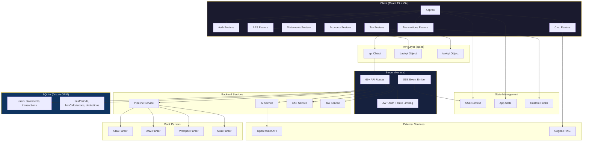
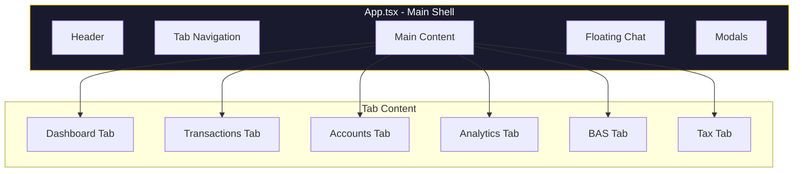

# CBA Statements Parser - Architecture Diagram

## System Overview

```mermaid
graph TB
    subgraph Client["Client (React 19 + Vite)"]
        App[App.tsx]
        Auth[Auth Feature]
        Transactions[Transactions Feature]
        Statements[Statements Feature]
        Accounts[Accounts Feature]
        BAS[BAS Feature]
        Tax[Tax Feature]
        Chat[Chat Feature]
    end

    subgraph State["State Management"]
        SSEContext[SSE Context]
        AppState[App State]
        Hooks[Custom Hooks]
    end

    subgraph API["API Layer (api.ts)"]
        CoreAPI[api Object]
        BASAPI[basApi Object]
        TaxAPI[taxApi Object]
    end

    subgraph Server["Server (Hono.js)"]
        Routes[65+ API Routes]
        Middleware[JWT Auth + Rate Limiting]
        Events[SSE Event Emitter]
    end

    subgraph Services["Backend Services"]
        Pipeline[Pipeline Service]
        AIService[AI Service]
        BASSvc[BAS Service]
        TaxSvc[Tax Service]
    end

    subgraph Parsers["Bank Parsers"]
        CBA[CBA Parser]
        ANZ[ANZ Parser]
        Westpac[Westpac Parser]
        NAB[NAB Parser]
    end

    subgraph Database["SQLite (Drizzle ORM)"]
        CoreTables[users, statements, transactions]
        TaxTables[basPeriods, basCalculations, deductions]
    end

    subgraph External["External Services"]
        OpenRouter[OpenRouter API]
        Cognee[Cognee RAG]
    end

    App --> Auth
    App --> Transactions
    App --> Statements
    App --> Accounts
    App --> BAS
    App --> Tax
    App --> Chat

    App --> AppState
    App --> SSEContext
    Transactions --> Hooks

    Transactions --> CoreAPI
    BAS --> BASAPI
    Tax --> TaxAPI

    CoreAPI --> Routes
    Routes --> Middleware
    Events --> SSEContext

    Routes --> Pipeline
    Routes --> AIService
    Routes --> BASSvc
    Routes --> TaxSvc

    Pipeline --> CBA
    Pipeline --> ANZ
    Pipeline --> Westpac
    Pipeline --> NAB

    Routes --> CoreTables
    Routes --> TaxTables

    AIService --> OpenRouter
    Chat --> Cognee

    style Client fill:#1a1a2e,stroke:#FFCC00,color:#fff
    style Server fill:#16213e,stroke:#FFCC00,color:#fff
    style Database fill:#0f3460,stroke:#FFCC00,color:#fff
```

## Technology Stack

```mermaid
graph LR
    subgraph Frontend["Frontend Stack"]
        React19[React 19]
        Vite[Vite]
        Tailwind[Tailwind CSS]
        Radix[Radix UI]
        Recharts[Recharts]
    end

    subgraph Backend["Backend Stack"]
        Hono[Hono.js]
        Drizzle[Drizzle ORM]
        SQLite[SQLite]
        JWT[JWT Auth]
    end

    subgraph AI["AI Stack"]
        OpenRouter[OpenRouter]
        Gemini[Gemini 3 Flash]
        Cognee[Cognee RAG]
    end

    Frontend --> Backend
    Backend --> AI

    style Frontend fill:#1a1a2e,stroke:#FFCC00,color:#fff
    style Backend fill:#16213e,stroke:#FFCC00,color:#fff
    style AI fill:#0f3460,stroke:#FFCC00,color:#fff
```

## Component Hierarchy

```mermaid
graph TD
    subgraph AppShell["App.tsx - Main Shell"]
        Header[Header]
        TabNav[Tab Navigation]
        MainContent[Main Content]
        FloatingChat[Floating Chat]
        Modals[Modals]
    end

    subgraph Tabs["Tab Content"]
        Dashboard[Dashboard Tab]
        TransTab[Transactions Tab]
        AccountsTab[Accounts Tab]
        AnalyticsTab[Analytics Tab]
        BASTab[BAS Tab]
        TaxTab[Tax Tab]
    end

    MainContent --> Dashboard
    MainContent --> TransTab
    MainContent --> AccountsTab
    MainContent --> AnalyticsTab
    MainContent --> BASTab
    MainContent --> TaxTab

    style AppShell fill:#1a1a2e,stroke:#FFCC00,color:#fff
```
