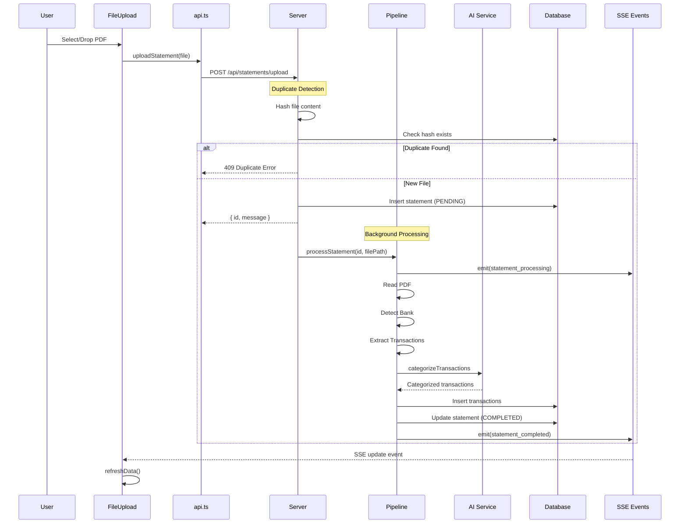
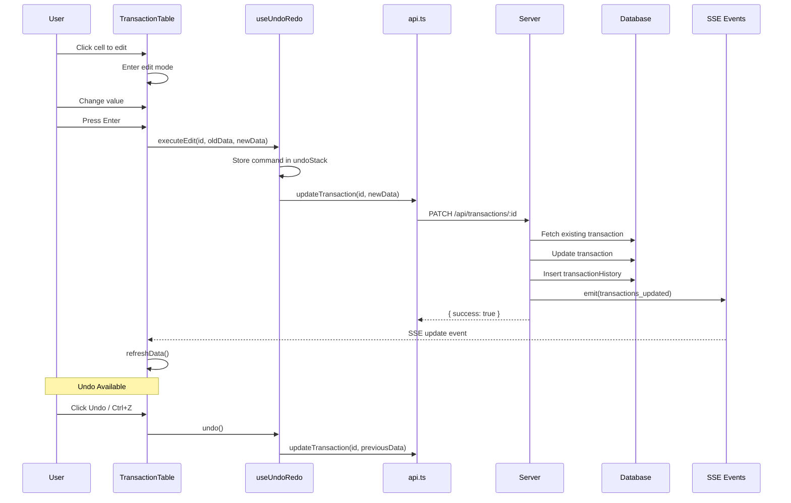
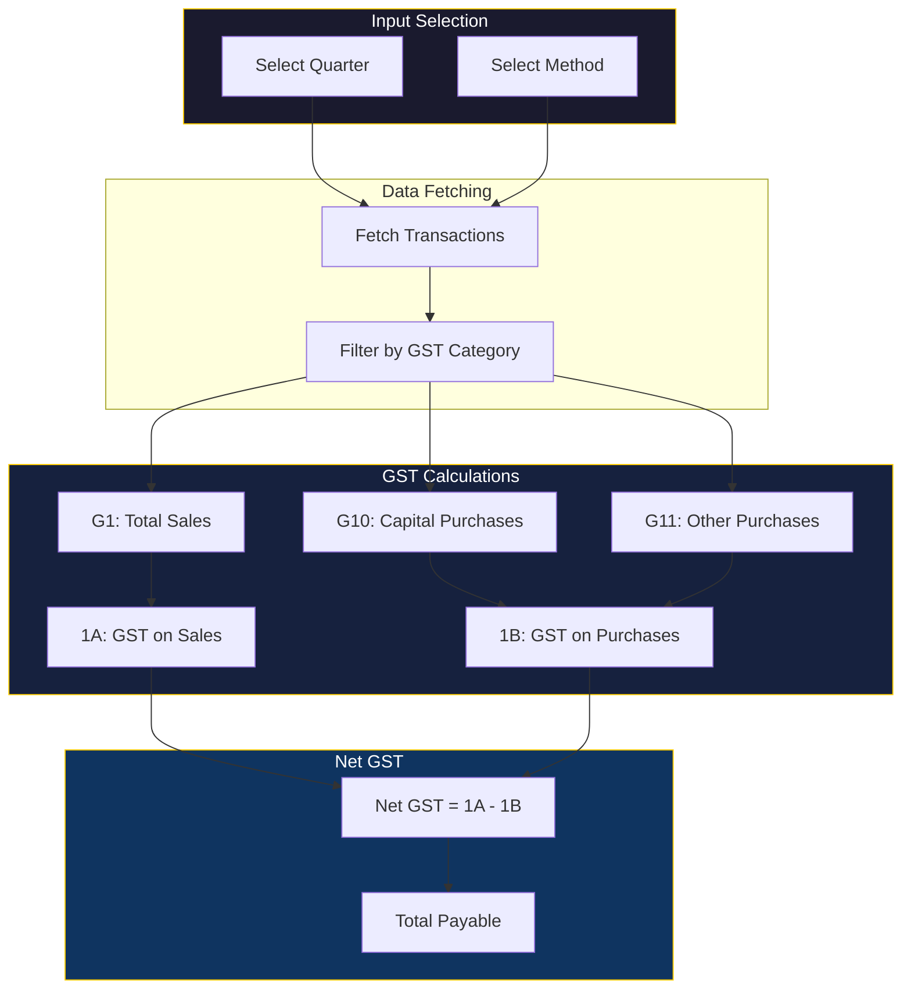
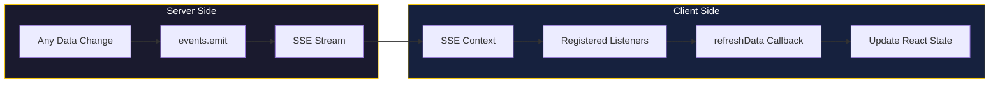

# CBA Statements Parser - Data Flow Diagrams

## Statement Upload Flow

```mermaid
sequenceDiagram
    participant U as User
    participant FU as FileUpload
    participant API as api.ts
    participant S as Server
    participant P as Pipeline
    participant AI as AI Service
    participant DB as Database
    participant SSE as SSE Events

    U->>FU: Select/Drop PDF
    FU->>API: uploadStatement(file)
    API->>S: POST /api/statements/upload

    Note over S: Duplicate Detection
    S->>S: Hash file content
    S->>DB: Check hash exists
    alt Duplicate Found
        S-->>API: 409 Duplicate Error
    else New File
        S->>DB: Insert statement (PENDING)
        S-->>API: { id, message }

        Note over P: Background Processing
        S->>P: processStatement(id, filePath)
        P->>SSE: emit(statement_processing)

        P->>P: Read PDF
        P->>P: Detect Bank
        P->>P: Extract Transactions

        P->>AI: categorizeTransactions
        AI-->>P: Categorized transactions

        P->>DB: Insert transactions
        P->>DB: Update statement (COMPLETED)
        P->>SSE: emit(statement_completed)
    end

    SSE-->>FU: SSE update event
    FU->>FU: refreshData()
```

## Transaction Edit Flow

```mermaid
sequenceDiagram
    participant U as User
    participant TT as TransactionTable
    participant UR as useUndoRedo
    participant API as api.ts
    participant S as Server
    participant DB as Database
    participant SSE as SSE Events

    U->>TT: Click cell to edit
    TT->>TT: Enter edit mode
    U->>TT: Change value
    U->>TT: Press Enter

    TT->>UR: executeEdit(id, oldData, newData)
    UR->>UR: Store command in undoStack

    UR->>API: updateTransaction(id, newData)
    API->>S: PATCH /api/transactions/:id

    S->>DB: Fetch existing transaction
    S->>DB: Update transaction
    S->>DB: Insert transactionHistory

    S->>SSE: emit(transactions_updated)
    S-->>API: { success: true }

    SSE-->>TT: SSE update event
    TT->>TT: refreshData()

    Note over U,TT: Undo Available
    U->>TT: Click Undo / Ctrl+Z
    TT->>UR: undo()
    UR->>API: updateTransaction(id, previousData)
```

## BAS Calculation Flow

```mermaid
flowchart TD
    subgraph Input["Input Selection"]
        SelectQuarter[Select Quarter]
        SelectMethod[Select Method]
    end

    subgraph Fetch["Data Fetching"]
        FetchTx[Fetch Transactions]
        FilterGST[Filter by GST Category]
    end

    subgraph Calculate["GST Calculations"]
        G1[G1: Total Sales]
        G10[G10: Capital Purchases]
        G11[G11: Other Purchases]
        Label1A[1A: GST on Sales]
        Label1B[1B: GST on Purchases]
    end

    subgraph NetGST["Net GST"]
        CalcNet[Net GST = 1A - 1B]
        TotalPayable[Total Payable]
    end

    SelectQuarter --> FetchTx
    SelectMethod --> FetchTx
    FetchTx --> FilterGST

    FilterGST --> G1
    FilterGST --> G10
    FilterGST --> G11

    G1 --> Label1A
    G10 --> Label1B
    G11 --> Label1B

    Label1A --> CalcNet
    Label1B --> CalcNet
    CalcNet --> TotalPayable

    style Input fill:#1a1a2e,stroke:#FFCC00,color:#fff
    style Calculate fill:#16213e,stroke:#FFCC00,color:#fff
    style NetGST fill:#0f3460,stroke:#FFCC00,color:#fff
```

## Real-time Sync Flow

```mermaid
flowchart LR
    subgraph Backend["Server Side"]
        Action[Any Data Change]
        Emit[events.emit]
        Stream[SSE Stream]
    end

    subgraph Frontend["Client Side"]
        SSEContext[SSE Context]
        Listener[Registered Listeners]
        RefreshData[refreshData Callback]
        UpdateState[Update React State]
    end

    Action --> Emit
    Emit --> Stream
    Stream --> SSEContext
    SSEContext --> Listener
    Listener --> RefreshData
    RefreshData --> UpdateState

    style Backend fill:#1a1a2e,stroke:#FFCC00,color:#fff
    style Frontend fill:#16213e,stroke:#FFCC00,color:#fff
```
