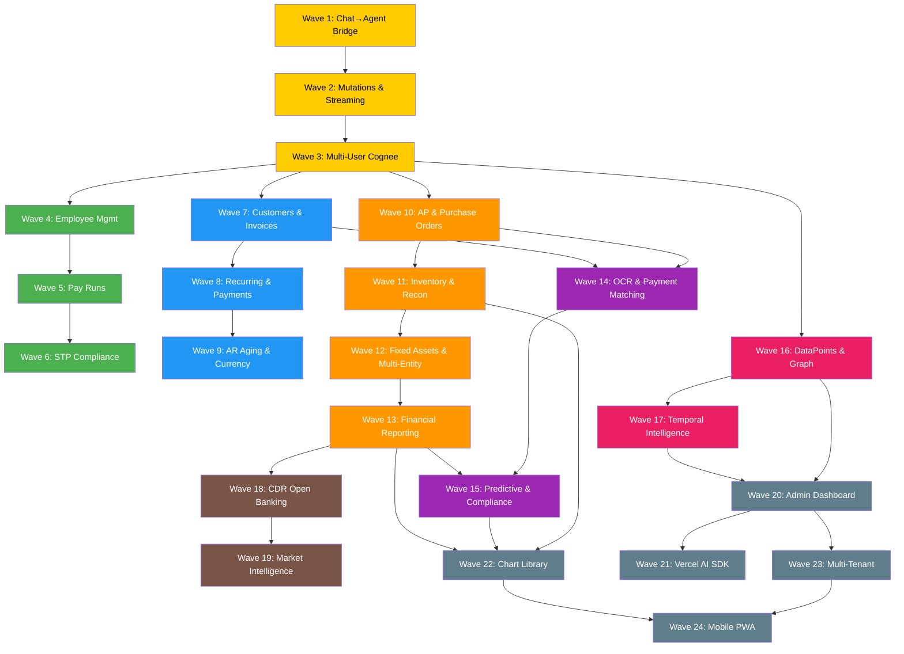

# R10 — Dependency & Ordering Analysis

**Agent**: R10 — Dependency & Ordering Analyzer
**Date**: 2026-02-13
**Scope**: Waves 1–24 complete dependency chain, execution order, critical path, risk matrix
**Sources**: `docs/Agent planning chat.md` (lines 682–1314), `docs/wave0-master-plan.md`, `wave0-reviews/D04-integration-review.md`, all 14 `wave{N}-orchestration-prompt.md` files

---

## 1. Dependency Graph

### 1.1 Wave 1–10: Declared Dependencies (from Planning Doc)

```
Wave  1: No prerequisites (FOUNDATIONAL)
Wave  2: Requires Wave 1 (intent router, agent dispatcher)
Wave  3: Requires Wave 2 (mutation framework for Cognee writes)
Wave  4: Requires Wave 3 (multi-user Cognee for payroll datasets)
Wave  5: Requires Wave 4 (employee tables, pay categories)
Wave  6: Requires Wave 5 (pay runs, leave management)
Wave  7: Requires Wave 3 (multi-user Cognee for customer datasets)  ← NOTE: Planning doc says Wave 6, task file says Wave 3
Wave  8: Requires Wave 7 (customers, invoices)
Wave  9: Requires Wave 8 (recurring invoices, payment gateways)
Wave 10: Requires Wave 3 (multi-user Cognee for supplier datasets)  ← NOTE: Planning doc says Wave 9, task file says Wave 3
```

### 1.2 CRITICAL: Dependency Discrepancy Resolution

The **planning doc** (`Agent planning chat.md`) declares:
- Wave 7: "Dependencies: **Wave 6** must complete" (line 1057)
- Wave 10: "Dependencies: **Wave 9** must complete" (line 1241)

The **task file** (`R10-dependency-ordering-analyzer.md`) declares:
- Wave 7: Depends on **Wave 3** (needs multi-user Cognee for customer datasets)
- Wave 10: Depends on **Wave 3** (needs multi-user Cognee for supplier datasets)

The **master plan** (`wave0-master-plan.md`) aligns with the task file:
```
Wave 3 ─┬→ Wave 4 → Wave 5 → Wave 6  (Payroll track)
         ├→ Wave 7 → Wave 8 → Wave 9  (Invoicing track)
         └→ Wave 10                     (AP track)
```

**RESOLUTION**: The master plan dependency graph is the **authoritative source**. The planning doc's per-wave dependency lines appear to be sequential (assuming linear execution), while the master plan's optimized graph shows the TRUE data dependencies. We adopt the master plan's optimized graph:

- **Wave 7 depends on Wave 3** (not Wave 6)
- **Wave 10 depends on Wave 3** (not Wave 9)

This is the key insight: after Wave 3, three parallel tracks open up.

### 1.3 Wave 11–24: Declared Dependencies (from Orchestration Prompts)

```
Wave 11: Requires Wave 10 (AP/PO for bill-to-inventory linking)
Wave 12: Requires Wave 11 (inventory for asset linking)
Wave 13: Requires Wave 12 (multi-entity for entity-scoped reports)
Wave 14: Requires Wave 7 + Wave 10 (invoices + bills for matching)    ← D04 CORRECTED
Wave 15: Requires Wave 13 + Wave 14 (reports + matching completeness)
Wave 16: Requires Wave 3 (multi-user Cognee isolation)                 ← EARLIEST possible after Phase 1
Wave 17: Requires Wave 16 (custom DataPoints and ontology layer)
Wave 18: Requires Wave 13 (financial reports for loan impact analysis)
Wave 19: Requires Wave 18 (CDR for product context)
Wave 20: Requires Wave 16 + Wave 17 (Cognee graph + cross-module intelligence)
Wave 21: Requires Wave 20 (admin dashboard for monitoring)
Wave 22: Requires Wave 13 + Wave 15 (financial reports + forecast data)  ← D04: also needs 11
Wave 23: Requires Wave 20 (admin + user management)
Wave 24: Requires Wave 22 + Wave 23 (responsive charts + tenant-aware auth)
```

### 1.4 D04 Corrections Applied

| Issue | Original | Corrected | Impact |
|-------|----------|-----------|--------|
| D01 | Wave 14 serialized after 11-13 | Wave 14 only needs 7+10 | Unlocks parallel execution |
| D02 | Wave 22 deps: 13, 15 | Wave 22 deps: 11, 13, 15 | Added Wave 11 dep (InventoryValuation.tsx) |
| D04 | Wave 20 deps: 16, 17 | Wave 20 deps: 16, 17 (+all agent-creating waves soft dep) | Admin shows all agents |
| D06 | Wave 16 serialized after 15 | Wave 16 only needs Wave 3 | Earliest possible start |

### 1.5 Complete Dependency Graph (ASCII)

```
PHASE 1 — Core Infrastructure (SEQUENTIAL)
═══════════════════════════════════════════
  Wave 1 ──→ Wave 2 ──→ Wave 3
                           │
           ┌───────────────┼───────────────┬──────────────────┐
           │               │               │                  │
PHASE 2    │    PHASE 3    │    PHASE 4    │    PHASE 6       │
Payroll    │    Invoicing  │    AP Track   │    Knowledge     │
═══════    │    ═════════  │    ════════   │    ═════════     │
Wave 4     │    Wave 7     │    Wave 10    │    Wave 16       │
  │        │      │        │      │        │      │           │
Wave 5     │    Wave 8     │    Wave 11    │    Wave 17       │
  │        │      │        │      │        │      │           │
Wave 6     │    Wave 9     │    Wave 12    │    Wave 20 ──────┤
           │               │      │        │      │           │
           │               │    Wave 13 ───┤    Wave 21       │
           │               │      │        │                  │
           │               │    Wave 14* ──┤    Wave 23 ──────┤
           │               │      │        │                  │
           │               │    Wave 15    │                  │
           │               │      │        │                  │
           │               │    Wave 18    │                  │
           │               │      │        │                  │
           │               │    Wave 19    │                  │
           │               │      │        │                  │
           │               │    Wave 22 ───┴──→ Wave 24       │
           │               │                                  │
           └───────────────┴──────────────────────────────────┘

  * Wave 14 depends on Wave 7 + Wave 10 (can run parallel with 11-13)
```

### 1.6 Mermaid Diagram



---

## 2. Execution Sequence — Waves 1–10

### Round 1: Wave 1 (No dependencies)
```
Launch: Wave 1 — Chat→Agent Bridge & Intent Routing
Agents: 10
Complexity: HIGH
Key deliverables: 31 PG table sync, intent router, agent dispatcher
Est. duration: 5-7 hours (largest single wave)
```

### Round 2: Wave 2 (After Wave 1)
```
Launch: Wave 2 — Transaction Mutation & Streaming
Agents: 10
Complexity: HIGH
Key deliverables: Mutation tools, SSE streaming, audit trail
Est. duration: 4-6 hours
```

### Round 3: Wave 3 (After Wave 2)
```
Launch: Wave 3 — Multi-User Cognee & Custom DataPoints
Agents: 10
Complexity: HIGH
Key deliverables: Per-user Cognee isolation, DataPoint models, sessions
Est. duration: 4-6 hours
```

### Round 4: Wave 4 + Wave 7 + Wave 10 (ALL THREE in parallel after Wave 3)
```
Launch simultaneously:
  ├─ Wave 4  — Employee Management & Pay Structures    (Payroll Track)
  ├─ Wave 7  — Customer Management & Invoice Generation (Invoicing Track)
  └─ Wave 10 — Accounts Payable & Purchase Orders       (AP Track)

Total agents: 30 (3 × 10)
Combined complexity: VERY HIGH + HIGH + HIGH
Est. duration: 6-8 hours (bottleneck: Wave 4 VERY HIGH)
```

### Round 5: Wave 5 + Wave 8 (Parallel, after Wave 4 and Wave 7)
```
Launch simultaneously:
  ├─ Wave 5 — Pay Run Processing & Leave Management  (needs Wave 4)
  └─ Wave 8 — Recurring Invoices & Payment Processing (needs Wave 7)

Note: Wave 10 may still be running or recently completed
Note: Wave 11 can start as soon as Wave 10 completes

Total agents: 20 (2 × 10)
Est. duration: 5-7 hours (bottleneck: Wave 5 VERY HIGH)
```

### Round 6: Wave 6 + Wave 9 (Parallel, after Wave 5 and Wave 8)
```
Launch simultaneously:
  ├─ Wave 6 — STP Compliance & Payroll Reporting (needs Wave 5)
  └─ Wave 9 — AR Aging & Multi-Currency          (needs Wave 8)

Total agents: 20 (2 × 10)
Est. duration: 4-5 hours (both HIGH/MEDIUM)
```

### Wave 1–10 Summary

| Round | Waves | Parallel Agents | Bottleneck | Cumulative Time |
|-------|-------|----------------|------------|-----------------|
| 1 | W1 | 10 | Wave 1 (HIGH) | ~6h |
| 2 | W2 | 10 | Wave 2 (HIGH) | ~11h |
| 3 | W3 | 10 | Wave 3 (HIGH) | ~16h |
| 4 | W4, W7, W10 | 30 | Wave 4 (VERY HIGH) | ~23h |
| 5 | W5, W8 | 20 | Wave 5 (VERY HIGH) | ~29h |
| 6 | W6, W9 | 20 | Wave 6 (HIGH) | ~34h |

**Total estimated: ~34 hours** (vs ~60 hours fully sequential = **43% time savings**)

---

## 3. Execution Sequence — Waves 11–24

### Phase A: After Wave 10 (and Wave 3 for Track 3)

```
Track 1 (Core Accounting):     Wave 11 → 12 → 13
Track 2 (AI Matching):         Wave 14 (needs W7+W10 only)
Track 3 (Knowledge Graph):     Wave 16 → 17 (needs W3 only — can start MUCH earlier!)
```

**KEY INSIGHT**: Track 3 (Waves 16-17) can start as early as Round 4 of Waves 1-10, since it only needs Wave 3. This is the biggest parallelization opportunity in the entire roadmap.

#### Phase A — Round A1 (After Wave 3 completes)
```
Launch: Wave 16 — Custom DataPoints & Graph Relationships
Complexity: MEDIUM
Note: Can start during Wave 1-10 execution!
```

#### Phase A — Round A2 (After Wave 10 completes + Wave 16 completes)
```
Launch simultaneously:
  ├─ Wave 11 — Inventory & Bank Reconciliation    (needs W10)
  ├─ Wave 14 — AI Document Processing & Matching  (needs W7+W10)
  └─ Wave 17 — Temporal Intelligence              (needs W16)
```

#### Phase A — Round A3 (After Wave 11 completes)
```
Launch: Wave 12 — Fixed Assets & Multi-Entity Consolidation (needs W11)
```

#### Phase A — Round A4 (After Wave 12 completes)
```
Launch: Wave 13 — Financial Reporting & Budgeting (needs W12)
```

### Phase B: After Phase A Converges

#### Phase B — Round B1 (After Wave 13 + Wave 14 + Wave 17 complete)
```
Launch simultaneously:
  ├─ Wave 15 — Predictive Analytics & Compliance  (needs W13+W14)
  ├─ Wave 18 — CDR Open Banking                   (needs W13)
  └─ Wave 20 — Admin Dashboard                    (needs W16+W17)
```

#### Phase B — Round B2 (After Wave 15 + Wave 18 + Wave 20 complete)
```
Launch simultaneously:
  ├─ Wave 19 — Market Intelligence                (needs W18)
  ├─ Wave 21 — Vercel AI SDK Migration            (needs W20)
  ├─ Wave 22 — Chart Library                      (needs W11+W13+W15)
  └─ Wave 23 — Multi-Tenant                       (needs W20)
```

### Phase C: Final Assembly

#### Phase C — Round C1 (After Wave 22 + Wave 23 complete)
```
Launch: Wave 24 — Mobile Responsive & PWA (needs W22+W23)
```

### Waves 11–24 Summary

| Round | Waves | Parallel | Dependencies | Cumulative (from W10) |
|-------|-------|----------|--------------|----------------------|
| A1* | W16 | 1 | W3 (starts early!) | +5h |
| A2 | W11, W14, W17 | 3 | W10, W7+W10, W16 | +6h |
| A3 | W12 | 1 | W11 | +5h |
| A4 | W13 | 1 | W12 | +5h |
| B1 | W15, W18, W20 | 3 | W13+W14, W13, W16+W17 | +6h |
| B2 | W19, W21, W22, W23 | 4 | W18, W20, W11+W13+W15, W20 | +5h |
| C1 | W24 | 1 | W22+W23 | +5h |

*A1 overlaps with Waves 4-10 execution

**Total estimated Waves 11-24: ~37 hours** (vs ~70 hours sequential = **47% savings**)

---

## 4. Critical Path Analysis

### 4.1 Primary Critical Path (Longest Sequential Chain)

```
Wave 1 → 2 → 3 → 10 → 11 → 12 → 13 → 15 → 22 → 24
                                     ↑
                                  (also needs W14→needs W7+W10)
```

**Length**: 10 waves
**Estimated duration**: ~55 hours

This is the **primary bottleneck** — any delay on this path delays the entire project.

### 4.2 Secondary Critical Path

```
Wave 1 → 2 → 3 → 16 → 17 → 20 → 23 → 24
```

**Length**: 8 waves
**Estimated duration**: ~42 hours

### 4.3 Tertiary Path (Payroll — no downstream dependencies beyond Wave 6)

```
Wave 1 → 2 → 3 → 4 → 5 → 6
```

**Length**: 6 waves
**Estimated duration**: ~32 hours

**NOTE**: The Payroll track (Waves 4-6) has NO downstream dependencies in Waves 11-24. It's a "leaf" branch. This means payroll can be deprioritized if resources are constrained, without affecting the critical path.

### 4.4 Critical Path Visualization

```
                                        CRITICAL PATH ★
                                        ═══════════════
Wave 1 ★ → Wave 2 ★ → Wave 3 ★ ──┬── Wave 4 → 5 → 6    (leaf, no downstream)
                                   ├── Wave 7 → 8 → 9    (leaf, feeds W14 only)
                                   ├── Wave 10 ★ → Wave 11 ★ → Wave 12 ★ → Wave 13 ★
                                   │                                           │
                                   │   Wave 14 ←(W7+W10)──────────────────────┤
                                   │     │                                     │
                                   │   Wave 15 ★ ←(W13+W14)                  Wave 18 → 19
                                   │     │
                                   │   Wave 22 ★ ←(W11+W13+W15)
                                   │     │
                                   ├── Wave 16 → 17 → 20 → 23 ──┤
                                   │                              │
                                   │              Wave 21         │
                                   │                              │
                                   └──────────────── Wave 24 ★ ←(W22+W23)
```

---

## 5. Cross-Wave Dependencies (Waves 1-10 ↔ Waves 11-24)

### 5.1 Forward Dependencies (Which Waves 1-10 outputs feed into 11-24?)

| Wave 1-10 Output | Consumed By (11-24) | What's Needed |
|-------------------|---------------------|---------------|
| **Wave 3** (Multi-User Cognee) | Wave 16 | Cognee user isolation, DataPoint foundation |
| **Wave 7** (Invoices) | Wave 14 | Invoice data for payment matching |
| **Wave 10** (AP/Bills) | Wave 11, Wave 14 | Bills for inventory linking, payment matching |
| **Wave 11** (Inventory) | Wave 12, Wave 22 | Inventory for asset linking, charts |
| **Wave 12** (Multi-Entity) | Wave 13 | Entity-scoped financial reports |
| **Wave 13** (Financial Reports) | Wave 15, Wave 18, Wave 22 | Trend data, loan analysis, charts |
| **Wave 14** (OCR/Matching) | Wave 15 | Matching completeness for compliance |
| **Wave 15** (Forecasting) | Wave 22 | Forecast data for charts |
| **Wave 16** (DataPoints) | Wave 17, Wave 20 | Ontology layer, graph data |
| **Wave 17** (Temporal) | Wave 20 | Cross-module intelligence for admin |
| **Wave 18** (CDR) | Wave 19 | Product context for market intel |
| **Wave 20** (Admin) | Wave 21, Wave 23 | Dashboard for SDK, user mgmt for tenants |
| **Wave 22** (Charts) | Wave 24 | Responsive chart components |
| **Wave 23** (Multi-Tenant) | Wave 24 | Tenant-aware auth for PWA |

### 5.2 Backward Dependencies (What Waves 11-24 need from 1-10)

| Waves 11-24 | Requires from 1-10 | Earliest Start |
|-------------|---------------------|----------------|
| Wave 11 | Wave 10 | After Round 4 of W1-10 (earliest) |
| Wave 12 | Wave 11 → Wave 10 | After W11 |
| Wave 13 | Wave 12 → ... → Wave 10 | After W12 |
| Wave 14 | Wave 7 + Wave 10 | After W7 AND W10 (Round 4+) |
| Wave 15 | Wave 13 + Wave 14 | After W13 AND W14 |
| **Wave 16** | **Wave 3 ONLY** | **After Round 3 of W1-10** |
| Wave 17 | Wave 16 → Wave 3 | After W16 |
| Wave 18 | Wave 13 → ... → Wave 10 | After W13 |
| Wave 19 | Wave 18 → Wave 13 | After W18 |
| Wave 20 | Wave 16 + Wave 17 | After W17 |
| Wave 21 | Wave 20 | After W20 |
| Wave 22 | Wave 11 + Wave 13 + Wave 15 | After W15 (latest dep) |
| Wave 23 | Wave 20 | After W20 |
| Wave 24 | Wave 22 + Wave 23 | After W22 AND W23 |

### 5.3 Key Insight: Wave 16 is the Parallelization Goldmine

Wave 16 (Custom DataPoints & Graph) only depends on Wave 3. Since Wave 3 completes in Round 3 (~16h), Wave 16 can start **during** the execution of Waves 4-10. This cascades:

```
Timeline:
  Hour 0-6:   Wave 1
  Hour 6-11:  Wave 2
  Hour 11-16: Wave 3
  Hour 16-22: Wave 4+7+10 (parallel) AND Wave 16 (parallel!)
  Hour 22-27: Wave 5+8 AND Wave 17 (parallel!)
  Hour 27-32: Wave 6+9
  Hour 32+:   Wave 11+14 (parallel) — Wave 17 already done!
```

This means Wave 20 (Admin Dashboard, needs W16+W17) can start much earlier than a naive sequential plan.

---

## 6. Risk Matrix

### 6.1 Single Points of Failure

| SPOF | Impact if Failed | Blast Radius | Mitigation |
|------|-----------------|--------------|------------|
| **Wave 1** | ALL subsequent waves blocked | 23 waves | Wave 1 is foundational — allocate best resources, extra testing |
| **Wave 2** | Waves 3-24 blocked | 22 waves | Strict validation before marking complete |
| **Wave 3** | Waves 4-24 blocked (ALL parallel tracks) | 21 waves | Extra focus on Cognee integration — most external dependency risk |
| **Wave 10** | Waves 11-13, 14, 15, 18-19, 22-24 blocked | 10+ waves | AP module — complex but well-defined schema |
| **Wave 13** | Waves 15, 18, 22, 24 blocked | 5 waves | Financial reports — high complexity |

### 6.2 Failure Scenarios

| Scenario | Probability | Impact | Mitigation |
|----------|------------|--------|------------|
| Wave 1 fails tsc --noEmit | MEDIUM | All blocked | Pre-validate types.ts before adding agents |
| Wave 3 Cognee auth fails | HIGH | 21 waves | Test against Cognee container in isolation first |
| Wave 10 takes 2× expected time | MEDIUM | Delays primary critical path | Can start Wave 16 independently |
| types.ts merge conflict (parallel waves) | HIGH | Agent registration failures | Pre-declare all AgentTypes before Wave 11 (AG01 fix) |
| Migration ordering error | LOW | Schema corruption | Validate migration numbering before each wave |
| BottomNavigation overflow | CERTAIN | UX degradation | Implement nav grouping before Wave 11 (F01 fix) |
| Docker build fails with new deps | MEDIUM | All blocked | Test Dockerfile changes in isolation |
| Cognee dataset explosion (31+) | MEDIUM | Performance degradation | Implement dataset governance |
| Redis not operational for W17 | LOW | Temporal queries fail | Health check in W17 orchestration |

### 6.3 Risk Severity Heat Map

```
                  Low Impact    Medium Impact    High Impact    Critical Impact
High Prob      │              │ types.ts        │ Cognee auth  │
               │              │ conflicts       │ Wave 3       │
               │              │                 │              │
Medium Prob    │              │ Docker builds   │ Wave 10      │ Wave 1
               │              │ Dataset bloat   │ delays       │ failure
               │              │                 │              │
Low Prob       │              │ Migration       │ Wave 13      │
               │              │ errors          │ failure      │
               │              │ Redis issues    │              │
```

---

## 7. Pre-Execution Prerequisites

Before launching Wave 1, these issues from D04 must be resolved:

### 7.1 BLOCKER Resolutions Required

| # | Issue | Resolution | Owner |
|---|-------|-----------|-------|
| 1 | AG01: AgentType union cross-wave locking | Pre-declare ALL 26 agent types in types.ts before Wave 1 | Pre-Wave-1 task |
| 2 | A01: `/api/forecasts` route collision W13 vs W15 | Rename W13 to `/api/budget-forecasts/*` | W13 orchestration update |
| 3 | F01: 21+ tabs in BottomNavigation | Implement nav grouping (Finance/Operations/Analytics/AI) before W11 | Pre-Wave-11 task |
| 4 | S02: Dual schema rule not in all waves | Add to shared coordination rules file | Documentation task |
| 5 | D01: Wave 14 dependency contradiction | RESOLVED: W14 needs W7+W10 only (can parallel with W11-13) | Already fixed in master plan |
| 6 | D02: Wave 22 undeclared dep on W11 | RESOLVED: Added W11 to W22 dependencies | Already fixed in master plan |

### 7.2 Recommended Pre-Actions

1. **Pre-declare all AgentTypes** in `types.ts` and `config.ts` (prevents cross-wave conflicts)
2. **Split `client/src/api.ts`** into per-feature API modules (prevents file contention)
3. **Add Vitest + Playwright** configuration (no testing framework exists)
4. **Implement BottomNavigation grouping** or sidebar navigation
5. **Create shared standards document** (dual schema, pagination, Zod validation rules)

---

## 8. Complete Launch Sequence (All 24 Waves)

### Grand Execution Timeline

```
                  Waves 1-10                    │            Waves 11-24
                  ══════════                    │            ═══════════
Hour  0: ┌─ Round 1: Wave 1 ─────────────────┐ │
Hour  6: └─────────────────────────────────── │ │
         ┌─ Round 2: Wave 2 ─────────────────┐ │
Hour 11: └─────────────────────────────────── │ │
         ┌─ Round 3: Wave 3 ─────────────────┐ │
Hour 16: └────────────────────────────────────┘ │
         ┌─ Round 4: Wave 4 ┐ ┌─ Wave 7 ┐ ┌─ Wave 10 ┐ │ ┌─ Wave 16 (A1)─┐
Hour 22: │                  │ │          │ │          │ │ └────────────────┘
         └──────────────────┘ └──────────┘ └──────────┘ │
         ┌─ Round 5: Wave 5 ┐ ┌─ Wave 8 ┐              │ ┌─ Wave 17 (A2)──┐
Hour 27: └──────────────────┘ └──────────┘              │ └────────────────┘
         ┌─ Round 6: Wave 6 ┐ ┌─ Wave 9 ┐              │
Hour 32: └──────────────────┘ └──────────┘              │
         ════════════════════════════════════════════════│═════════════════════
                                                        │ ┌ W11 ┐ ┌ W14 ┐ (A2 cont.)
Hour 37: ──────────────────────────────────────────────── └──────┘ └──────┘
                                                        │ ┌─ Wave 12 (A3) ──┐
Hour 42: ──────────────────────────────────────────────── └─────────────────┘
                                                        │ ┌─ Wave 13 (A4) ──┐
Hour 47: ──────────────────────────────────────────────── └─────────────────┘
                                                        │ ┌ W15 ┐ ┌ W18 ┐ ┌ W20 ┐ (B1)
Hour 53: ──────────────────────────────────────────────── └──────┘ └──────┘ └──────┘
                                                        │ ┌ W19 ┐┌ W21 ┐┌ W22 ┐┌ W23 ┐(B2)
Hour 58: ──────────────────────────────────────────────── └──────┘└──────┘└──────┘└──────┘
                                                        │ ┌─ Wave 24 (C1) ──┐
Hour 63: ──────────────────────────────────────────────── └─────────────────┘
```

**Total estimated: ~63 hours** with maximum parallelization
**vs sequential: ~120+ hours** = **~48% time savings**

---

## 9. Launch Commands

### Waves 1–10 Launch Sequence

```bash
# ═══════════════════════════════════════════════════════════
# ROUND 1: Wave 1 (No dependencies)
# ═══════════════════════════════════════════════════════════
bash launch-wave1.sh
# Wait for all .agent-done-W01-* markers (10 files)

# ═══════════════════════════════════════════════════════════
# ROUND 2: Wave 2 (After Wave 1)
# ═══════════════════════════════════════════════════════════
bash launch-wave2.sh
# Wait for all .agent-done-W02-* markers

# ═══════════════════════════════════════════════════════════
# ROUND 3: Wave 3 (After Wave 2)
# ═══════════════════════════════════════════════════════════
bash launch-wave3.sh
# Wait for all .agent-done-W03-* markers

# ═══════════════════════════════════════════════════════════
# ROUND 4: Wave 4 + Wave 7 + Wave 10 + Wave 16 (PARALLEL)
# ═══════════════════════════════════════════════════════════
bash launch-wave4.sh &
bash launch-wave7.sh &
bash launch-wave10.sh &
bash launch-wave16.sh &
wait
# Wait for .agent-done-W04-*, W07-*, W10-*, W16-* markers

# ═══════════════════════════════════════════════════════════
# ROUND 5: Wave 5 + Wave 8 + Wave 17 (PARALLEL)
#   Wave 5 needs W4, Wave 8 needs W7, Wave 17 needs W16
# ═══════════════════════════════════════════════════════════
bash launch-wave5.sh &
bash launch-wave8.sh &
bash launch-wave17.sh &
wait
# Wait for .agent-done-W05-*, W08-*, W17-* markers

# ═══════════════════════════════════════════════════════════
# ROUND 6: Wave 6 + Wave 9 (PARALLEL)
#   Wave 6 needs W5, Wave 9 needs W8
# ═══════════════════════════════════════════════════════════
bash launch-wave6.sh &
bash launch-wave9.sh &
wait
# Wait for .agent-done-W06-*, W09-* markers
```

### Waves 11–24 Launch Sequence

```bash
# ═══════════════════════════════════════════════════════════
# PHASE A — Round A2: Wave 11 + Wave 14 (PARALLEL)
#   Wave 11 needs W10, Wave 14 needs W7+W10
#   Wave 16+17 already launched in Rounds 4-5
# ═══════════════════════════════════════════════════════════
bash launch-wave11.sh &
bash launch-wave14.sh &
wait

# ═══════════════════════════════════════════════════════════
# PHASE A — Round A3: Wave 12 (needs W11)
# ═══════════════════════════════════════════════════════════
bash launch-wave12.sh
# Wait for .agent-done-W12-*

# ═══════════════════════════════════════════════════════════
# PHASE A — Round A4: Wave 13 (needs W12)
# ═══════════════════════════════════════════════════════════
bash launch-wave13.sh
# Wait for .agent-done-W13-*

# ═══════════════════════════════════════════════════════════
# PHASE B — Round B1: Wave 15 + Wave 18 + Wave 20 (PARALLEL)
#   W15 needs W13+W14, W18 needs W13, W20 needs W16+W17
# ═══════════════════════════════════════════════════════════
bash launch-wave15.sh &
bash launch-wave18.sh &
bash launch-wave20.sh &
wait

# ═══════════════════════════════════════════════════════════
# PHASE B — Round B2: Wave 19 + Wave 21 + Wave 22 + Wave 23 (PARALLEL)
#   W19 needs W18, W21 needs W20, W22 needs W11+W13+W15, W23 needs W20
# ═══════════════════════════════════════════════════════════
bash launch-wave19.sh &
bash launch-wave21.sh &
bash launch-wave22.sh &
bash launch-wave23.sh &
wait

# ═══════════════════════════════════════════════════════════
# PHASE C: Wave 24 (needs W22+W23)
# ═══════════════════════════════════════════════════════════
bash launch-wave24.sh
# Wait for .agent-done-W24-*

# ═══════════════════════════════════════════════════════════
# DONE — All 24 waves complete
# ═══════════════════════════════════════════════════════════
echo "GoldLedger platform build complete!"
```

### Marker File Verification Script

```bash
#!/bin/bash
# verify-wave-completion.sh — Check if a wave is fully done
WAVE=$1
EXPECTED=10
COUNT=$(ls .agent-done-W${WAVE}-* 2>/dev/null | wc -l)
if [ "$COUNT" -eq "$EXPECTED" ]; then
  echo "✅ Wave $WAVE: COMPLETE ($COUNT/$EXPECTED agents done)"
  exit 0
else
  echo "⏳ Wave $WAVE: IN PROGRESS ($COUNT/$EXPECTED agents done)"
  ls .agent-done-W${WAVE}-* 2>/dev/null
  exit 1
fi
```

---

## 10. Optimized Execution Summary

### 10.1 Execution Rounds (Total: 12 rounds)

| Round | Waves Launched | Parallel Streams | Dependencies Met |
|-------|---------------|-----------------|-----------------|
| R1 | W1 | 1 | None |
| R2 | W2 | 1 | W1 |
| R3 | W3 | 1 | W2 |
| R4 | W4, W7, W10, W16 | 4 | W3 |
| R5 | W5, W8, W17 | 3 | W4, W7, W16 |
| R6 | W6, W9 | 2 | W5, W8 |
| R7 | W11, W14 | 2 | W10, W7+W10 |
| R8 | W12 | 1 | W11 |
| R9 | W13 | 1 | W12 |
| R10 | W15, W18, W20 | 3 | W13+W14, W13, W16+W17 |
| R11 | W19, W21, W22, W23 | 4 | W18, W20, W11+W13+W15, W20 |
| R12 | W24 | 1 | W22+W23 |

### 10.2 Maximum Concurrency Profile

```
Round:   R1  R2  R3  R4   R5  R6  R7  R8  R9  R10  R11  R12
Waves:    1   1   1   4    3   2   2   1   1    3    4    1
Agents:  10  10  10  40   30  20  20  10  10   30   40   10
                     ▲                          ▲
                Peak concurrency: 40 agents  Peak again: 40 agents
```

### 10.3 Resource Planning

- **Minimum**: 10 concurrent agents (1 wave at a time)
- **Optimal**: 40 concurrent agents (Rounds 4 and 11)
- **Total agent-waves**: 24 waves × 10 agents = 240 agent executions
- **Total estimated time**: ~63 hours with parallelization
- **Sequential baseline**: ~120 hours
- **Time savings**: ~48%

---

## 11. Appendix: Wave-by-Wave Quick Reference

| Wave | Name | Deps | Complexity | New Tables | New Agents | Migration |
|------|------|------|-----------|-----------|-----------|-----------|
| 1 | Chat→Agent Bridge | None | HIGH | 31 (sync) | 0 | 0013 |
| 2 | Mutations & Streaming | W1 | HIGH | 3 | 0 | 0014 |
| 3 | Multi-User Cognee | W2 | HIGH | 2 | 0 | 0015 |
| 4 | Employee Management | W3 | VERY HIGH | 7 | 0 | 0016 |
| 5 | Pay Runs & Leave | W4 | VERY HIGH | 7 | 0 | 0017 |
| 6 | STP Compliance | W5 | HIGH | 7 | 0 | 0018 |
| 7 | Customers & Invoices | W3 | HIGH | 6 | 1 | 0019 |
| 8 | Recurring & Payments | W7 | MEDIUM | 5 | 0 | 0020 |
| 9 | AR Aging & Currency | W8 | MEDIUM | 4 | 0 | 0021 |
| 10 | AP & Purchase Orders | W3 | HIGH | 9 | 1 | 0022 |
| 11 | Inventory & Recon | W10 | HIGH | 7 | 2 | 0023 |
| 12 | Fixed Assets & Entity | W11 | HIGH | 10 | 2 | 0024 |
| 13 | Financial Reporting | W12 | HIGH | 8 | 2 | 0025 |
| 14 | OCR & Matching | W7+W10 | MED-HIGH | 5 | 2 | 0026 |
| 15 | Predictive & Compliance | W13+W14 | HIGH | 6 | 2 | 0027 |
| 16 | DataPoints & Graph | W3 | MEDIUM | 3 | 0 | 0028 |
| 17 | Temporal Intelligence | W16 | MEDIUM | 4 | 0 | 0029 |
| 18 | CDR Open Banking | W13 | HIGH | 9 | 1 | 0030 |
| 19 | Market Intelligence | W18 | HIGH | ~6 | 1 | 0031 |
| 20 | Admin Dashboard | W16+W17 | HIGH | 7 | 0 | 0032 |
| 21 | Vercel AI SDK | W20 | HIGH | ~3 | 0 | 0033 |
| 22 | Chart Library | W11+W13+W15 | MEDIUM | 2 | 0 | 0034 |
| 23 | Multi-Tenant | W20 | CRITICAL | 8 | 1 | 0035 |
| 24 | Mobile PWA | W22+W23 | MED-HIGH | 3 | 0 | 0036 |
| **TOTAL** | | | | **~161** | **~15** | **24** |
